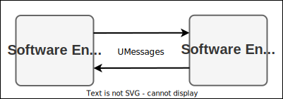

= Eclipse-uProtocol Specification image:logo/uprotocol_logo.png[uProtocol Logo,width=640]
:toc:
:sectnums:

The key words "*MUST*", "*MUST NOT*", "*REQUIRED*", "*SHALL*", "*SHALL NOT*", "*SHOULD*", "*SHOULD NOT*", "*RECOMMENDED*", "*MAY*", and "*OPTIONAL*" in this document are to be interpreted as described in https://www.rfc-editor.org/info/bcp14[IETF BCP14 (RFC2119 & RFC8174)]

----
Licensed to the Apache Software Foundation (ASF) under one
or more contributor license agreements.  See the NOTICE file
distributed with this work for additional information
regarding copyright ownership.  The ASF licenses this file
to you under the Apache License, Version 2.0 (the
"License"); you may not use this file except in compliance
with the License.  You may obtain a copy of the License at

  http://www.apache.org/licenses/LICENSE-2.0

Unless required by applicable law or agreed to in writing,
software distributed under the License is distributed on an
"AS IS" BASIS, WITHOUT WARRANTIES OR CONDITIONS OF ANY
KIND, either express or implied.  See the License for the
specific language governing permissions and limitations
under the License.
----

== Purpose

A software defined vehicle requires the design and development of software entities that are distributed by nature, deployed in different os/hw environments (mechatronics, high-compute, mobile phones, and the cloud).

Every environment have their own software development, deployment, and communications protocols, thus resulting in no common interface,language or means for said distributed software to seamlessly discover, connect, and communicate with each other in a transparent, simplified, and secure manner.

uProtocol addresses the above-mentioned problem by defining an ubiquitous language that includes:

1. Transport layer interface: Common way to  `send()` and `receive()` messages regardless of the underlining networking transport protocol

2. Common Message Definitions

3. Common application layer interfaces for core business logic (ex. subscription management, discovery, etc...)

<> image below provides a high-level view of what we aim to define in this specification. The arrows between the uEs are the physical/virtual transport (anything from OSI layer 2 protocol up to automotive/Internet application layer protocols, and everything in-between. The icon image:https://cloudevents.io/img/logos/cloudevents-icon-color.png[CloudEvents,25,35] represents the messages sent between uEs that, for the remainder of this document, referred to as CloudEvents or CEs.

.uProtocol Overview
[#img-overview]

== link:basics/README.adoc[The Basics]
In this section of the specifications we cover the foundations of uProtocol such as CloudEvents, UUIDs, naming conventions and more.

== Layers

.uProtocol Layers
[#img-layers]
image::layers.drawio.svg[uProtocol Layers]

uProtocol consists of three layers as depicted in <> above, they are:

1. link:up-l1/[*Transport & Session Layer (uP-L1):*] Bidirectional point-2-point communication between uEs (how messages are sent and received between uEs).

2. link:up-l2/[*Communication (Messaging) Layer (uP-L2):*] Defines the message types, headers, format, and delivery semantics. uProtocol builds upon https://cloudevents.io/[CNCF CloudEvent] specifications as a way to describe the messages in a common way

3. link:up-l3/[*Application Layer (uP-L3):*] Also known as the business logic layer, responsible for declaration and definition of interfaces between clients and servers (ex. subscription management, discovery, etc...)

== Software Entities (uEs)
A uE is software that communicates with other software using uProtocol.

<> below illustrates the set of uProtocol defined uEs required to implement the protocol.

.uE Classifications
[#img-ues]
image::ues.drawio.svg[uEs]

=== Communication Backbone

uEs in this category are essential for dispatching/routing of messages between uEs, uDevices, and uDomains.

.Communication uEs
[width=100%",cols="30%,70%"]
|===
|uE Name |Description

|link:up-l2/dispatchers/README.adoc[*Dispatchers*]
|Message dispatches sending CEs between uEs, between devices, etc...

|link:../../src/main/proto/core/usubscription/v2/README.adoc[*uSubscription*]
|Implement the publisher/subscriber architecture pattern within and between devices. Used by dispatchers to multicast messages to subscribers

|===

=== Core uEs
Core uEs are business layer logic to perform a specific function of the protocol highlighted in the table below.

.Core uEs
[width=100%",cols="30%,70%"]
|===
|uE Name |Description

|link:../../src/main/proto/core/udiscovery/v2/README.adoc[uDiscovery]
|Discovery (services, devices, topics, methods, properties, etc...)

|link:../../src/main/proto/core/utwin/v2/README.adoc[uTwin]
|Local (to the device) caches of published information for subscribed topics

|===

NOTE: Please see link:principles.adoc[Guiding Principles] for more information about motivations and high-level requirements/principles driving the specification
