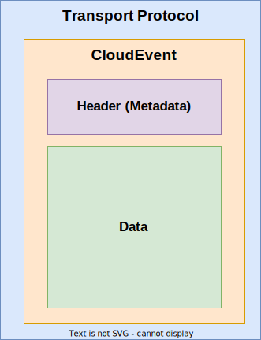

= CloudEvents
:toc:
:sectnums:
:stem: latexmath

The key words "*MUST*", "*MUST NOT*", "*REQUIRED*", "*SHALL*", "*SHALL NOT*", "*SHOULD*", "*SHOULD NOT*", "*RECOMMENDED*", "*MAY*", and "*OPTIONAL*" in this document are to be interpreted as described in https://www.rfc-editor.org/info/bcp14[IETF BCP14 (RFC2119 & RFC8174)]

----
Copyright (c) 2023 General Motors GTO LLC

Licensed to the Apache Software Foundation (ASF) under one
or more contributor license agreements.  See the NOTICE file
distributed with this work for additional information
regarding copyright ownership.  The ASF licenses this file
to you under the Apache License, Version 2.0 (the
"License"); you may not use this file except in compliance
with the License.  You may obtain a copy of the License at

  http://www.apache.org/licenses/LICENSE-2.0

Unless required by applicable law or agreed to in writing,
software distributed under the License is distributed on an
"AS IS" BASIS, WITHOUT WARRANTIES OR CONDITIONS OF ANY
KIND, either express or implied.  See the License for the
specific language governing permissions and limitations
under the License.

SPDX-FileType: DOCUMENTATION
SPDX-FileCopyrightText: 2023 General Motors GTO LLC
SPDX-License-Identifier: Apache-2.0
----

== Overview

https://cloudevents.io/[CloudEvents] is a CNCF specification for describing events in a common way. We will use CloudEvents to formulate all kinds of uProtocol messages that will be sent to and from uEs.

.CloudEvents

CloudEvents are:

* An envelope for information about the occurrence of change in a system, it has a "from" address (source) with the "to" address is optional (sink)
* carry facts in metadata with standard attributes
* Self-contained & unique (you don't need to attach data to an event)
* Can be encoded/decoded into different formats without losing/modifying information

Cloud Events answers the following in the metadata:

* What kind of event?--> *type*
* When was it sent? --> *time*
* Who sent it? -->**source**
* What is the event unique identifier? --> *id*
* What is the shape of the data event? --> *dataschema*
* What is the event data? --> *data*

The specification is transport agnostic (can run over HTTP, MQTT, AMQP, NATS, Kafka), and comes with SDK in most common languages.

=== CloudEvent Format vs Data Format

CloudEvents can be represented as objects (in the programming language of choice) as well as serialized to any binary or text encoding formats such as protobuf, JSON, AVRO, XML, etc.... CloudEvent are often referred to as "the envelope for data" as it holds the data and metadata.

https://cloudevents.io/[CloudEvents] has defined a set of specifications for the well know formats (ex. https://github.com/cloudevents/spec/blob/v1.0.2/cloudevents/formats/json-format.md[JSON], https://github.com/cloudevents/spec/blob/v1.0.2/cloudevents/formats/protobuf-format.md[Protobuf], etc..) as well as how to send these messages over well-known transports (ex. https://github.com/cloudevents/spec/blob/v1.0.2/cloudevents/bindings/http-protocol-binding.md[HTTP], https://github.com/cloudevents/spec/blob/v1.0.2/cloudevents/bindings/mqtt-protocol-binding.md[MQTT], etc..).

NOTE: Additional formats and transports not covered by https://cloudevents.io/[CloudEvents.io] shall be covered in link:../up-l1/README.adoc[uP-L1 Specifications]

== uProtocol CloudEvents
The following section we shall elaborate how map link:uattrbutes.adoc[uProtocol Header Attributes (uAttributes)] to CloudEvents attributes.

=== Common Attributes
Common attributes apply to all message types.

.Common Message Header Attributes
[width="100%",cols="12%,8%,12%,10%,54%",options="header",]
[#common-message-attributes]
|===
|CE Attribute
|https://github.com/eclipse-uprotocol/uprotocol-core-api/blob/main/src/main/proto/uattributes.proto[uProtocol Attribute]
|CE Type
|RFC2119
|Description

|https://github.com/cloudevents/spec/blob/v1.0.2/cloudevents/spec.md#specversion[`specversion`]
| N/A
|String
|*R*
a|CloudEvent specification version. This is *NOT* the uProtocol version

* *MUST* be set to "1.0"

|https://github.com/cloudevents/spec/blob/v1.0.2/cloudevents/spec.md#id[`id`]
|`id`
|String
|*R*
a|Unique identifier for the CE

* *MUST* adhere to link:../basics/uuid.adoc[uProtocol UUID] requirements

|https://github.com/cloudevents/spec/blob/v1.0.2/cloudevents/spec.md#source-1[source]
|N/A
|https://www.rfc-editor.org/rfc/rfc3986#section-4.1[Uri-Reference]
|*R*
a|The Source (address) of the message per table below

.`source` Description
[#message-source]
!===
!Type !Description

!*Publish & Notification*
! The Producers topic

!*Request*
!The calling uE response topic

!*Response*
!Method URI
!===

* * *MUST* be long form URI per link:../basics/uri.adoc[URI Specifications]
* *MUST* include the `authority`, `UE_NAME`, `UE_VERSION`
* UE_VERSION
** *MUST* include MAJOR
** *MAY* include MINOR
** *MUST NOT* include PATCH

|https://github.com/cloudevents/spec/blob/v1.0.2/cloudevents/spec.md#type[`type`]
|`type`
|String
|*R*
a|uProtocol CE type

* *MUST* be value defined in <<message-types>> table below

.Message Types
[#message-types]
!===
!UMessageType !CE Value

!*`PUBLISH`*
! `pub.v1`

!*`REQUEST`*
!`req.v1`

!*`RESPONSE`*
!`res.v1`

!===

|https://github.com/cloudevents/spec/blob/main/subscriptions/spec.md#sink[`sink`]
|link:README.adoc#_sink[`sink`]
|https://www.rfc-editor.org/rfc/rfc3986#section-4.1[Uri-Reference]
|*R\|O*
a|URI pointing to the method to be invoked

* *MUST* be present if message type is *NOT*  `pub.v1`
* *MUST* be either a short form or long form URI per link:../basics/uri.adoc[URI Specifications]
* *MUST* include destination authority (UDEVICE.UDOMAIN)
* *MUST* contain destination UE_NAME and UE_VERSION and METHOD
* METHOD
** *MUST* be prepended with rpc.
** *MUST* include method NAME
*  UE_VERSION
** *MUST* include MAJOR
** *MAY* include MINOR
** *MUST NOT* include PATCH

|https://github.com/cloudevents/spec/blob/v1.0.2/cloudevents/spec.md#datacontenttype[datacontenttype]
|https://github.com/eclipse-uprotocol/uprotocol-core-api/blob/main/src/main/proto/upayload.proto[UPayloadFormat] (not part of UAttributes)
|String
|*O*
a|Content type of data value. This attribute enables data to carry any type of content, whereby format and encoding might differ from that of the chosen event format

* *MUST* adhere to the format specified in https://tools.ietf.org/html/rfc2046[RFC 2046]
* *MUST* be application/octet-stream for binary encoded data that is not protobuf
* *SHALL* be application/x-protobuf if attribute is missing

|`hash`
|N/A. (Transport specific)
|Binary
|*O*
|HMAC generated on the data portion of the message using a device key

|`priority`
|`priority`
|String
|*O*
a| uProtocol Prioritization classifications per link:../../basics/qos.adoc[QoS]. When this field is missing, `CS0` is assumed.
When the message _type_ is `req.v1`:

* *MUST* be set to `CS4` or greater

|`ttl`
|`ttl`
|Uint32
a|*R\|O*
a|How long this event should live for after it was generated (in milliseconds). Event expires when:

stem:[t_current > t_{ce_id} + ce_ttl]

When the message _type_ is `req.v1`:

* Attribute *MUST* be present and value greater than 0

otherwise:

* Attribute *MAY* be present
* When not present, or value is 0, message *MUST NOT* time out

|`traceparent`
|`traceparent`
|String
|*O*
| Contains a version, trace ID, span ID, and trace options as defined in https://w3c.github.io/trace-context/#traceparent-header[section 3.2].  Intended to be compatible with https://github.com/cloudevents/spec/blob/main/cloudevents/extensions/distributed-tracing.md[CloudEvents distributed tracing extension].

|===

=== RPC Attributes
Additional attributes are included for RPC for correlation, access control, and more.

NOTE: RPC response RESOURCE portion of a topic is: `rpc.response`

==== Request
.Common Message Header Attributes
[width="100%",cols="12%,18%,8%,8%,53%",options="header",]
|===
|CE Attribute
|https://github.com/eclipse-uprotocol/uprotocol-core-api/blob/main/src/main/proto/uattributes.proto[uProtocol Attribute]
|CE Type
|RFC2119
|Description

|`*token*`
|`token`
|String
|*R\|O*
a|Access token per link:../up-l2/permissions.adoc#_token_based_access_permissionstaps[Token-Based uE Access Permissions (TAPs)]

|`*plevel*`
|`permission_level`
|Integer
|*R\|O*
|Source (senders) uE permission level as defined in link:../up-l2/permissions.adoc#_code_based_access_permissions_caps[Code-Based uE Access Permissions (CAPs)]

|===

==== Response

.RPC Response Message
[width="100%",cols="13%,10%,13%,8%,25%,32%",options="header",]
|===
|CE Attribute
|https://github.com/eclipse-uprotocol/uprotocol-core-api/blob/main/src/main/proto/uattributes.proto[uProtocol Attribute]
| CE Type
|RFC 2119
|Description
|Requirements

|`*reqid*` 
|`reqid`
|String 
|*R* 
|Request Identifier a.k.a correlation ID between this response and the original request  
a|
* *MUST* be the link:../basics/uuid.adoc[uProtocol UUID] from the original Request message (req.v1) that this response is for

|`*commstatus*`
|`commstatus`
|Integer
|*O*
|Communication error attribute populated by uP-L2 dispatchers only when an error has occurred in the delivery of RPC request or response events. +
The contents of this attribute, if present, is the integer representation of https://github.com/googleapis/googleapis/blob/master/google/rpc/code.proto[google.rpc.Code]
a|* *MUST* only be populated by Dispatchers when a deivery error has occured. See link:../../dispatchers/README.adoc[Dispatchers] for more information.

|===

== Data (Payload)

Data portion of the CE contains the application layer (uP-L2) message also known as the link:README.adoc#_upayload[UPayload]. 

== CloudEvent Format
In this section we will explain the format (encoding) for CloudEvent message and the impacts on the payload formats.

.Formats
[#ce-formats]
[width="100%",cols="20%,15%,65%",options="header",]
|===
|CE Format |Encoding |Data Format Considerations

|https://github.com/cloudevents/spec/blob/v1.0.2/cloudevents/formats/protobuf-format.md[*Protobuf*]
|Binary
a|* *MUST* adhere to the https://github.com/cloudevents/spec/blob/v1.0.2/cloudevents/formats/protobuf-format.md[Protobuf Event Format for CloudEvents - Version 1.0.2] specifications

If link:README.adoc#_upayload[UPayload] is a protobuf message:

* *MUST* be packed as google.protobuf.Any and stored in field proto_data
* *MUST NOT* set datacontenttype to "application/x-protobuf"
* *MUST NOT* set dataschema to the URI of the protobuf message, this is optional as this information is already stored in the google.protobuf.Any

If the link:/README.adoc#_upayload[UPayload] is binary and _NOT_ a protobuf message:

* *MUST* be stored in the field binary_data
* *MUST* set datacontenttype to "application/octet-stream"
* *MAY* set dataschema to the URI-Reference schema of the data

|https://github.com/cloudevents/spec/blob/v1.0.2/cloudevents/formats/json-format.md[*JSON*]
|Text
a|* *MUST* adhere to https://github.com/cloudevents/spec/blob/v1.0.2/cloudevents/formats/json-format.md[JSON Event Format for CloudEvents - Version 1.0.2] specifications

If link:README.adoc#_upayload[UPayload] is a protobuf message:

* *MUST* be packed as google.protobuf.Any and stored in field data_base64 attribute,
* *MUST NOT* set datacontenttype to "application/x-protobuf"
* *MUST NOT* set dataschema to the URI of the protobuf message, this is optional as this information is already stored in the google.protobuf.Any

If link:README.adoc#_upayload[UPayload] is binary and _NOT_ a protobuf message:

* *MUST* be base64 encoded and stored in data_base64 attribute
* *MUST* set datacontenttype to "application/octet-stream"
* *MAY* set dataschema to the URI-Reference schema of the data

|===

The following are additional recommendations when implementing the protocol:

* Data and CE *SHOULD* only be serialized once when it is to be transported over link:README.adoc#_utransport_interface[UTransport Interface]

== Examples
The following examples are using the JSON CE format

=== Publish
[source]
----
{
    "specversion": "1.0",
    "id": "cf8b1bcd-30bd-43be-a8d3-ad1cde652e10",
    "source": "//VCU.VIN/body.access/1/door.front_left#Door",
    "type": "pub.v1",
    "priority": "CS1",
    "ttl": 10000,
    "data": /* Protobuf serialized Door Message*/
}
----

=== Request
[source]
----
{
    "specversion": "1.0",
    "id": "cf8b1bcd-30bd-43be-a8d3-ad1cde652e10",
    "source": "//VCU.VIN/MyAppp/1/rpc.response",
    "sink": "//VCU.VIN/body.access/1/rpc.UpdateDoor",
    "type": "req.v1",
    "priority": "CS4",
    "ttl": 50000,
    "data": /* Protobuf serialized UpdateDoorRequest Message*/
}
----

=== Response
[source]
----
{
    "specversion": "1.0",
    "id": "5b9fe861-8c1c-4899-9b07-ad1cde652e10",
    "source": "//VCU.VIN/body.access/1/rpc.UpdateDoor",
    "sink": "//VCU.VIN/MyAppp/1/rpc.response",
    "type": "res.v1",
    "priority": "CS4",
    "reqid": "cf8b1bcd-30bd-43be-a8d3-ad1cde652e10",
    "ttl": 50000,
    "data": /* Protobuf serialized google.rpc.Status Message*/
}
----
