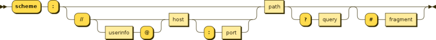
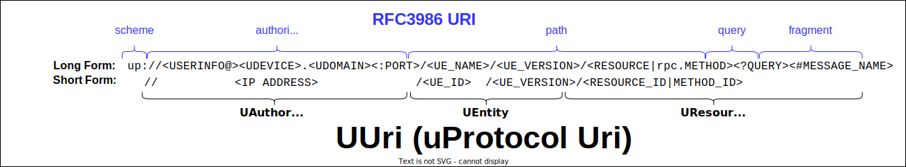

= uProtocol URI (UUri)
:toc:
:sectnums:

The key words "*MUST*", "*MUST NOT*", "*REQUIRED*", "*SHALL*", "*SHALL NOT*", "*SHOULD*", "*SHOULD NOT*", "*RECOMMENDED*", "*MAY*", and "*OPTIONAL*" in this document are to be interpreted as described in https://www.rfc-editor.org/info/bcp14[IETF BCP14 (RFC2119 & RFC8174)]

== Overview 
URIs are used to uniquely identify (or address) stuff such as devices, software entities, topics, methods, etc...). A common URI definition allows _stuff_ to be addressable anywhere on any heterogeneous system.

=== RFC3986

The standard URI format is defined in https://datatracker.ietf.org/doc/html/rfc3986[RFC3986] and illustrated in the figure below.

.URI

URI specifications are covered at length in RFC3986 and will not be covered in this document, we will focus on the additions to RFC3986 that are specific to the uProtocol.

The following is taken from https://datatracker.ietf.org/doc/html/rfc3986#appendix-A[RFC3986 Appendix-A] and shall be used as reference in this specification:

[source]
----
 gen-delims = ":" / "/" / "?" / "#" / "\[" / "\]" / "@"
 sub-delims = "!" / "$" / "&" / "'" / "(" / ")"
 / "*" / "+" / "," / ";" / "="
 pchar = unreserved / pct-encoded / sub-delims / ":" / "@"
 unreserved = ALPHA / DIGIT / "-" / "." / "_" / "~"
 reserved = gen-delims / sub-delims
----

<<uuri-specification>> diagram below provides an overview of the specifications that we will elaborate in this document. 

.URI Specification
[#uuri-specification]

A uProtocol URI can be represented in three formats:

1. <<UUri Data Model>>: A Language specific representation of a URI (i.e. class, structures, etc..)
2. <<Long Uris>>: UUri object serialized to a string containing names (i.e. human readable)
3. <<Micro Uris>>: UUri serialized to a byte array (i.e. machine readable). 

We shall elaborate on each format in this specification.

== UUri Data Model

TODO: Add all the specific details about the objects in these requirements based on Java SDK implementation

UUri is a language specific representation of the uProtocol URI. This section shall explain the requirements for each SDK to implement such that the mental model is the same across all programming languages.

 * Type name *MUST* be `UUri`
 * *MUST* have-a <<UAuthority>>, <<UEntity>>, and <<UResource>> types 
 * *MUST* have methods to build `UUri` using <<UAuthority>>, <<UEntity>>, and <<UResource>>
  * *MUST* have an api called `boolean isResolved()` that returns true if the UUri contains information to be able to serialize to <<Long Format>> or <<Micro Format>> 
 * *MUST* contain helper functions to build well known UUris
 
NOTE: the term *_Fully Qualified URI_* refers to a long or short form URI that contains all the items (UAuthority, UEntity, and UResource)

=== UAuthority
`UAuthority` type is responsible for storing the uDevice and uDomain portion of the uProtocol URI.

 * Type name *MUST* be `UAuthority`
 * *MUST* contain `domain` and `device` member variables of type `std::string` with accessor methods of the same name to fetch each
 * *MUST* contain `address` member variable of type `InetAddress` with accessor method of the same name to fetch it
 * *MUST* be able to construct a `UAuthority` from a string
 * *MUST* support detection of local vs remote URIs from `UAuthority`
 * *MUST* contain helper functions to build well known UAuthority items (local, remote, etc...)
 
if the authority is an IP address:

 * IP address *MUST* be stored in `device` member variable 

=== UEntity

`UEntity` type contains the uE id, name, and version portion of the uProtocol URI.

 * Type name *MUST* be `UEntity`
 * *MUST* contain `name` variable of type `std::string`, with accessor method of the same name to fetch the value
  * *MUST* contain `version` variable of type integer, with accessor method of the same name to fetch the value
 * *MUST* contain `id` member variable of type `uint16_t` (short) with accessor method of the same name to fetch it
 * *MUST* be able to construct a `UAuthority` from a string

=== UResource
`UResource` contains the resource id, name, instance, and message portion of the uProtocol uRI.

 * Type name *MUST* be `UResource`
 * *MUST* contain `name`, `instance`, and `message` member variables of type `std::string` with accessor methods of the same name to fetch each
 * *MUST* contain `id` member variable of type `uint16_t` (short) with accessor method of the same name to fetch it
 * *MUST* be able to construct a `UResource` from:
  - String representation of `UResource` per the URI specifications
  - `name` and `instance` only
  - `name` only

=== id
the UUri ID is used by some transports to map the UUri (long/short/micro format (described below) to a transport specific ID. the parameter allows for optimizations at the transport layer that use IDs in lieu of uProtocols long/short/micro uris. 

 * Type name *MUST* be `id`
 * *MUST* fit within a 64 bit (long) with accessor method of the same name to fetch it
 * *MAY* be a 32 bit integer

== Long Uris

Long URIs are UUris that have been serialized to a string and contains human readable names.

.Long Form URI Description
[#long-form-uri]
[width="100%",cols="23%,18%,59%",options="header"]
|===
|Item |Value |Description

|`*up:*` |up: |Scheme (protocol name)
|*USERINFO* |pchar |User information
|*UDEVICE* |unreserved |Canonical hostname or IP address of the device following https://datatracker.ietf.org/doc/html/rfc1035[RFC1035] requirements.
|*UDOMAIN* | |Canonical domain name of the device following https://datatracker.ietf.org/doc/html/rfc1035[RFC1035] requirements.
|*PORT* |uint |The external port that the device streamer is listening on. Default **MAY **be 443
|*UE* |pchar |The name of the uE
|*UE_VERSION* |pchar a|
uE version  section.

If the URI is part of a topic:

* *MUST* only contain the MAJOR version number

|*METHOD* |pchar |Service rpc method name as defined in the service proto file, contains the prefix rpc. before the method name
|*RESOURCE* |pchar |A uThing that can be uniquely identified using a URI and manipulated/controlled by a service. Resources unique scope is when prepended with device and service to become a fully qualified URI. uThings that are not resources may be a service specific features, functionality, capabilities, etc…
|*MESSAGE* |*( pchar / "/" / "?" ) |Protobuf message name as defined in https://developers.google.com/protocol-buffers/docs/overview.
|===

*Additional URI Protocol Rules:*

* *MAY* contain schema
* A segment in the path (UE_NAME, UE_VERSION, RESOURCE, METHOD) *MAY* be empty, resulting in two consecutive slashes (//) in the path component
* Schema and authority *MUST* be case-insensitive per RFC3986
* Path, query, and message *MUST* be case-sensitive

If a segment in the path is empty:

* The path *MUST NOT* start with "//"
* Path *MUST* be https://www.rfc-editor.org/rfc/rfc3986#section-3.3[path-abempty] (i.e. its value can be either an absolute path or empty)

NOTE: Local URIs do not contain the authority and begin with `/` (forward slash)

== Micro Uris
Micro URIs are used to represent various portions of the URI in byte array format using only the IDs for various portions of UAuthority, UEntity, and UResource. Micro URIs may be used in the uProtocol transport layer (uP-L1) to reduce the size of the URI and improve performance. There are three formats for micro URIs, local (missing the Address), IPv4, and IPv6. The following sections will describe each format.

.Local
[#local-micro-uri,java]
----
 0                   1                   2                   3
 0 1 2 3 4 5 6 7 8 9 0 1 2 3 4 5 6 7 8 9 0 1 2 3 4 5 6 7 8 9 0 1
+-+-+-+-+-+-+-+-+-+-+-+-+-+-+-+-+-+-+-+-+-+-+-+-+-+-+-+-+-+-+-+-+
|  UP_VERSION   |      TYPE     |           URESOURCE_ID        |
+-+-+-+-+-+-+-+-+-+-+-+-+-+-+-+-+-+-+-+-+-+-+-+-+-+-+-+-+-+-+-+-+
|        UENTITY_ID             |  UE_VERSION   |   UNUSED      |
+-+-+-+-+-+-+-+-+-+-+-+-+-+-+-+-+-+-+-+-+-+-+-+-+-+-+-+-+-+-+-+-+
----

.IPv4
[#ipv4-micro-uri,java]
----
 0                   1                   2                   3
 0 1 2 3 4 5 6 7 8 9 0 1 2 3 4 5 6 7 8 9 0 1 2 3 4 5 6 7 8 9 0 1
+-+-+-+-+-+-+-+-+-+-+-+-+-+-+-+-+-+-+-+-+-+-+-+-+-+-+-+-+-+-+-+-+
|  UP_VERSION   |      TYPE     |           URESOURCE_ID        |
+-+-+-+-+-+-+-+-+-+-+-+-+-+-+-+-+-+-+-+-+-+-+-+-+-+-+-+-+-+-+-+-+
|                     UAUTHORITY_ADDRESS                        |
+-+-+-+-+-+-+-+-+-+-+-+-+-+-+-+-+-+-+-+-+-+-+-+-+-+-+-+-+-+-+-+-+
|        UENTITY_ID             |  UE_VERSION   |   UNUSED      |
+-+-+-+-+-+-+-+-+-+-+-+-+-+-+-+-+-+-+-+-+-+-+-+-+-+-+-+-+-+-+-+-+
----

.IPv6
[#ipv6-micro-uri,java]     
----
 0                   1                   2                   3
 0 1 2 3 4 5 6 7 8 9 0 1 2 3 4 5 6 7 8 9 0 1 2 3 4 5 6 7 8 9 0 1 
+-+-+-+-+-+-+-+-+-+-+-+-+-+-+-+-+-+-+-+-+-+-+-+-+-+-+-+-+-+-+-+-+
|  UP_VERSION   |      TYPE     |           URESOURCE_ID        |
+-+-+-+-+-+-+-+-+-+-+-+-+-+-+-+-+-+-+-+-+-+-+-+-+-+-+-+-+-+-+-+-+
|                                                               |
|                     UAUTHORITY_ADDRESS                        |
|                                                               |
|                                                               |
+-+-+-+-+-+-+-+-+-+-+-+-+-+-+-+-+-+-+-+-+-+-+-+-+-+-+-+-+-+-+-+-+
|        UENTITY_ID             |  UE_VERSION   |   UNUSED      |
+-+-+-+-+-+-+-+-+-+-+-+-+-+-+-+-+-+-+-+-+-+-+-+-+-+-+-+-+-+-+-+-+
----    

* All fields *MUST* be populated
* Fields are Big-Endian unless otherwise specified

.Micro Uri Fields
[#micro-uri-fields,width="100%",cols="20%,10%,30%,40%",options="header"]
|===
|Field |Size |Description | Requirements

|`UP_VERSION` |8 |Current version of this specification | *MUST* be 0x01

|`TYPE` | 8 |Type of Micro Uri   a| *MUST* be one of the following values:

!===
!*Value* !*Description*
!0x00 !Local
!0x1 !IPv4
!0x2 !IPv6
!others !Reserved for future use
!===

|`URESOURCE_ID` |16 |The ID assigned to the topic in the proto (unique per uE) | 

|`UAUTHORITY_ADDRESS` |32 or 128 |UAuthority IP Address | *MUST* be a valid IPv4 or IPv6 address

|`UENTITY_ID` | 16 |UE Identifiers |

|`UE_VERSION` | 8 |UEntity MAJOR version | *MUST* be a valid MAJOR version

|`UNUSED` | 8 | Unused bits | *MUST* be 0x00

|===

== Wildcards
wildcard are used to replace portions of the URI to perform pattern matching (i.e. subscribing to multiple topics, searching for services, etc...). 
 
 * *SHOULD* support wildcards in the authority, entity, resource, and message portions of the URI
 * Wildcards *MUST* be `*` (asterisk) for long URIs
 * Wildcard *MUST* be the 0 for micro URIs

NOTE: Not all uPlatforms and uEs support wildcards, please refer to the uPlatform and uE documentation for more information.

== Example URIs

The section will give a few example URIs and their use in uProtocol. Service and resource will be generalized in this section. Example devices used for reference are http://bo.up.gm.com[bo.up.gm.com] representing the back office device, and VIN representing a vehicle.

NOTE: To illustrate the different URI formats, we will use uSubscription service definitions and IDs found in https://github.com/eclipse-uprotocol/uprotocol-core-api/blob/main/src/main/proto/core/usubscription/v2/usubscription.proto[usubscription.proto]. 

NOTE: Remote examples below shall assumed the device names have already been resolved to IP addresses

. Serialized Uri Examples
[width="100%",cols="20%,60%,20%",options="header"]
|===
|Example | Long (Serialized to String) | Micro (Serialized to byte[])

| Local
|`"/core.usubscription/2/rpc.Subscribe"`
|`[1, 0, 0, 1, 0, 0, 16, 0]`

|Remote (IPv4)
|`"//192.168.1.100/core.usubscription/2/rpc.Subscribe"`
|`[1, 1, 0, 1, -64, -88, 1, 100, 0, 0, 16, 0]` 

|Remote (IPv6)
|`"//2001:db8:85a3:0:0:8a2e:370:7334/core.usubscription/2/rpc.Subscribe"`
| `[1, 2, 0, 1, 32, 1, 13, -72, -123, -93, 0, 0, 0, 0, -118, 46, 3, 112, 115, 52, 0, 0, 16, 0]` 

|===

=== Wildcard Examples
.Query URIs
[width="100%",cols="30%,70%",options="header"]
|===
| URI | Description

|up:/body.access/*/
|Reference latest version since version information is blank

|up:/body.access/[^1\|1}1.x\|1.*\|~1]
|Any version between 1.0.0 and 2.0.0
|up:/body.access/^1
|Resolve vehicle service from resource
|===

NOTE: Please also refer to https://devhints.io/semver[devhints.io/semver] for more examples of version strings

== Best Practices

As mentioned above, UUri is the datamodel that represents the uProtocol URI in object form per programming language where as Long and Short Uris are serialized representations of the UUri object to be used (sent) between uEs, devices, etc... 

uProtocol URI specifications complies with of https://datatracker.ietf.org/doc/html/rfc3986[RFC3986] that builds https://datatracker.ietf.org/doc/html/rfc1034[DNS concepts and facilities] to allow representation of UAuthorty as names or IP addresses. 

A resolved UUri is one that contains both the Long and Micro Uri information meaning both the names and IDs such that the UUri can be serialized to either a string (long) or byte[] (short) format. When a UUri is not resolved (only contain either names or ids), the only way to resolve the UUri is to lookup in uDiscovery the missing information. UEntity & UResource resolved information is encoded into the service definitions (proto files) using  https://protobuf.dev/programming-guides/proto2/#options[Options], this means that Application layer (uP-L3) uEs (client and servers) have available the ability to populate fully resolved UUris. 

link:../up-l2/README.adoc[Dispatchers] however do not have the id mapping metadata as they are only provided either serialized Long or Micro Uris so if they have to send a Uri in a different format, they have no choice but to dynamically lookup (resolve) the Uri. 

UAuthority portion of the URI comply with IETF DNS RFCs meaning that resaolving the authority portion of the Uri is done using standard dns resolvers. Not all devices are globally addressable (through a recursive DNS servers). (ex. mobile devices behind a firewall) so care must be taken when resolving Uris). 

IMPORTANT: If a uE has a specific Uri format requirements (Long vs Micro), they *MUST* document them in their respective APIs specifications. Please see link:../up-l3/README.adoc#_core_platform_ues[Core Platform uEs] for more specific requirements for uProtocol core services.

The next sections shall provide best practices for populating and using URIs in uProtocol.

=== UAuthority
* Local communication (within the same device) *SHOULD* use local URIs (empty authority)
* Remote communication (between devices) *MUST* contain at least the device name
* Intra-domain name/address resolution *MUST* be locally resolvable (i.e. does not require global recursive dns resolution)

=== UEntity & UResource

==== uTransports (uP-L1)

* *MUST* declare which type of URIs, long, micro or both. Passing a UUri with missing information to construct the format will result in an `INVALID_PARAMETER` returned error
* *SHOULD* use Micro Uris when at all possible

==== Streamers (uP-L2)
Streamers are dispatchers that bridge from one transport technology to the next (ex. from HTTP to MQTT). Given that the UUri format is dependent on the transport: 

* *MUST* ensure that the Uri is converted to the target transports format (i.e. deserialized to UUri, resolved, then serialized to the correct long or short format) 

==== Application Layer (uP-L3) uEs
* *MUST* populate both the name and ids portion of UEntity & UResource objects

