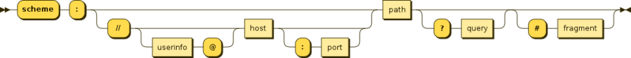
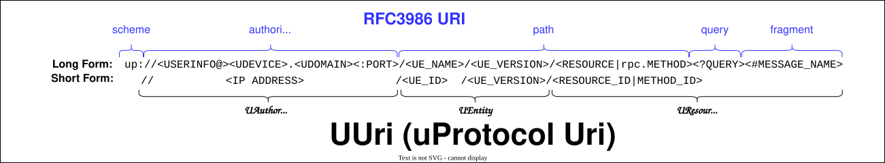

= uProtocol URI (UUri)
:toc: preamble
:sectnums:
:source-highlighter: highlight.js

The key words "*MUST*", "*MUST NOT*", "*REQUIRED*", "*SHALL*", "*SHALL NOT*", "*SHOULD*", "*SHOULD NOT*", "*RECOMMENDED*", "*MAY*", and "*OPTIONAL*" in this document are to be interpreted as described in https://www.rfc-editor.org/info/bcp14[IETF BCP14 (RFC2119 & RFC8174)]

----
SPDX-FileCopyrightText: 2023 Contributors to the Eclipse Foundation

See the NOTICE file(s) distributed with this work for additional
information regarding copyright ownership.

This program and the accompanying materials are made available under
the terms of the Apache License Version 2.0 which is available at
https://www.apache.org/licenses/LICENSE-2.0
 
SPDX-FileType: DOCUMENTATION
SPDX-License-Identifier: Apache-2.0
----

== Overview 

uProtocol uses https://datatracker.ietf.org/doc/html/rfc3986[Uniform Resource Identifiers] (URI) to uniquely identify (and/or address) resources such as devices,
software components, topics, methods, etc on a computer network. https://datatracker.ietf.org/doc/html/rfc3986[RFC3986] defines the structure of a URI as follows:

.URI

Using this terminology, a uProtocol URI (UUri) can be structured like this:

.UUri Specification
[#uuri-specification]

A UUri can be represented as:

* An instantiation of the <<data-model-definition>> in a supported programming language
* A URI string as defined by <<uri-definition>>

In the remainder of this document, the term _UUri_ is used to refer to an instantiation of the data model, whereas the term _URI_ is used to refer to its textual representation.

[#data-model-definition]
== Data Model

The diagram below shows a UUri and its properties using UML2 notation.

.UUri Data Model
[#uuri-data-model]
[mermaid]
ifdef::env-github[[source,mermaid]]
----
classDiagram

class UUri {
  authority_name : String
  ue_type_id : UInt16
  ue_instance_id : UInt16
  ue_version_major : UInt8
  resource_id : UInt16
}
----

[.specitem,oft-sid="dsn~uri-data-model-naming~2",oft-needs="impl"]
--
Each link:../languages.adoc[uProtocol Language Library] *MUST* implement the data model using the type and property names as defined in the following sections.
--

[.specitem,oft-sid="req~uri-data-model-proto~1",oft-needs="impl,utest"]
--
Each link:../languages.adoc[uProtocol Language Library] *MUST* support writing and reading of an instance of the data model to/from a protobuf as defined in link:../up-core-api/uprotocol/v1/uri.proto[uri.proto].
--

The remainder of this section defines the requirements for the data model by means of _invariants_ which must hold true at all times. Additionally, there are some _predicates_ that can be used by uEntities to determine if a UUri contains the information they are interested in. Both the invariants and the predicates are (formally) defined by means of link:https://www.omg.org/spec/OCL/2.4[Object Constraint Language] (OCL) expressions on the UUri data model. The link:https://modeling-languages.com/ocl-tutorial/[OCL Tutorial] provides an overview of the basic concepts used in the definitions.

=== Authority

An authority represents the deployment location of a specific software entity. The location is represented by means of a logical identifier like a domain name (e.g. `mcu1.example.com`) or a Vehicle Identification Number (VIN).

[.specitem,oft-sid="dsn~uri-authority-name-length~1",oft-needs="impl,utest"]
--
A UUri's `authority_name` *MUST NOT* exceed 128 characters in length.

[source,ocl]
----
inv: authority_name.length() <= 128
----
--

=== uEntity

A uProtocol software entity (uEntity) is a piece of software deployed somewhere on a network host.
uEntities are uniquely identified within a system by means of the type and version of the service interface that they implement and an instance identifier in case multiple instances of the same service are deployed in the system.

NOTE: uEntities which produce events for consumption by other uEntities assume a _Service_ role. +
uEntities which consume events produced by other uEntities assume an _Application_ role. +
uEntities *MAY* assume both the Service and Application roles.

[.specitem,oft-sid="dsn~uri-entity-type-id~1"]
--
A UUri's `ue_type_id` property value represents the uEntity's _type of service_. Its value is a numeric identifier as defined by the uProtocol Service Registry.
--

[.specitem,oft-sid="dsn~uri-entity-instance-id~1",oft-needs="impl,utest"]
--
A UUri's `ue_instance_id` property value uniquely identifies a _service instance_ among other uEntities of the same _service type_ within the same authority. Its value *MUST* be from the `[0x0001; 0xFFFF]` interval.

[source,ocl]
----
inv: ue_instance_id >= 0x0001 and ue_instance_id <= 0xFFFF
----
--

=== Resource

A service interface consists of _resources_ and _methods_. A resource usually represents the state of a property of the service (instance) while methods are used to manage the state of a service (instance).

Resources and methods are uniquely identified within a service interface by means of their numeric identifier.

[.specitem,oft-sid="dsn~uri-resource-id~1"]
--
A UUri's `resource_id` contains the identifier of the resource or method being referred to.
--

[#uri-definition]
== Mapping to URI

It is often helpful to represent UUris in a textual format, for example when serializing uProtocol messages to a transport's Protocol Data Unit (PDU). This section defines how UUris can be mapped to and from a URI according to the https://datatracker.ietf.org/doc/html/rfc3986#section-4.1[URI-Reference rule of RFC3986].

The URIs mapped from UUris use the syntax defined in https://datatracker.ietf.org/doc/html/rfc3986#appendix-A[RFC3986, Appendix A] with a few modifications:

[.specitem,oft-sid="dsn~uri-scheme~1",oft-needs="impl,utest"]
--
A URI *MUST NOT* use any scheme other than `up` and *MUST NOT* have a _query_ component and *MUST NOT* have a _fragment_ component.
--
[source,abnf]
----
URI = "up" ":" hier-part
relative-ref = relative-part
----

[.specitem,oft-sid="dsn~uri-host-only~2",oft-needs="impl,utest"]
--
The _authority_ component of a URI *MUST* consist of characters according to the following rule:
[source,abnf]
----
lc-unreserved = *( %x61-7A / DIGIT / "-" / "." / "_" / "~" )
               ; lowercase only unreserved
authority = IP-literal / IPv4address / lc-unreserved / "*"
----
In particular, the authority *MUST NOT* contain any _userinfo_ nor _port_.
--

NOTE: The ABNF fragments above only contain the rules that differ from the original definitions in RFC3986.

[.specitem,oft-sid="dsn~uri-authority-mapping~1",oft-needs="impl,utest"]
--
A URI's _authority_ *MUST* be mapped to/from the UUri's `authority_name` property following the rules defined in link:https://datatracker.ietf.org/doc/html/rfc3986#section-3.2.2[RFC3986, Section 3.2.2]. In particular, the URI *MUST NOT* contain an _authority_ if `authority_name` is empty and vice versa.
--

[.specitem,oft-sid="dsn~uri-path-mapping~3",oft-needs="impl,utest"]
--
A URI's _path_ *MUST* be mapped to/from the UUri's `ue_type_id`, `ue_instance_id`, `ue_version_major` and `resource_id` properties.

Each property value *MUST* be mapped to a _segment_ following the rules defined in link:https://datatracker.ietf.org/doc/html/rfc3986#section-3.3[RFC3986, Section 3.3].

The `ue_instance_id` and `ue_type_id` *MUST* be mapped to the _first_ path segment containing the concatenation of the _upper-case_ link:https://www.rfc-editor.org/rfc/rfc4648#section-8[base16 encoding]
of their respective property values.

The `ue_version_major` *MUST* be mapped to the _second_ path segment containing the _upper-case_ link:https://www.rfc-editor.org/rfc/rfc4648#section-8[base16 encoding]
of its property value.

The `resource_id` *MUST* be mapped to the _third_ path segment containing the _upper-case_ link:https://www.rfc-editor.org/rfc/rfc4648#section-8[base16 encoding]
of its property value.

Leading zeros (`0`) *SHOULD* be omitted in order to reduce the length of the URI. When creating a UUri from a URI, lower-case base16 encoded values *MUST* be accepted as well in order to improve interoperability. Note that this does not conflict with the rules defined in <<Pattern Matching>>.
--

=== Examples

The examples below can be used as test vectors for implementing client libraries.

[%autowidth]
|===
|authority |type ID |instance ID |version |resource |URI

| `""`
| `0x00c0`
| `0x0001`
| `0x03`
| `0x00f1`
| `up:/100C0/3/F1`

| `"192.168.1.10"`
| `0x0b10`
| `0x10a2`
| `0x1a`
| `0x8000`
| `up://192.168.1.10/10A20B10/1A/8000`
|===

== Serialization

[.specitem,oft-sid="req~uri-serialization~1",oft-needs="impl,utest"]
--
Each link:../languages.adoc[uProtocol Language Library] *MUST* provide means to serialize UUris to the <<_mapping_to_uri, URI format>> and vice versa. A concrete implementation should follow common practices for the particular programming language.
--

For example, a Java library might implement a `UriSerializer` class providing corresponding _static_ methods.

[source,java]
----
public final class UriSerializer {
  /**
   * @returns The UUri parsed from the given string representation.
   * @throws UuriSerializationException if the given string is not a valid URI.
                        The exception may contain details regarding the violated
                        constraint(s).
   */
  public static UUri deserialize(String: uri) throws UuriSerializationException {
    ...
  }
  /**
   * @returns The given UUri's string representation.
   * @throws UuriSerializationException if the UUri cannot be serialized.
   */
  public static String serialize(UUri: uuri) throws UuriSerializationException {
    ...
  }
}
----

Alternatively, the `UUri` class might provide corresponding methods.

[source,java]
----
public class UUri {
  /**
   * @returns The UUri parsed from the given string representation.
   * @throws UuriSerializationException if the given string is not a valid
                         URI. The exception may contain details
   *                     regarding the violated constraint(s).
   */
  public static UUri fromUri(String: uri) throws UuriSerializationException {
    ...
  }
  /**
   * @returns The given UUri's string representation.
   * @throws UuriSerializationException if this UUri cannot be serialized.
   */
  public final String toUri() throws UuriSerializationException {
    ...
  }
}
----

Similarly, a Rust library might implement a `UriSerializer` struct providing corresponding functions

[source,rust]
----
pub struct UriSerializer {}

impl UriSerializer {
  pub fn try_deserialize(uri: &str) -> Result<UUri, UuriSerializationError> {
    ...
  }
  pub fn try_serialize(uuri: &UUri) -> Result<String, UuriSerializationError> {
    ...
  }
}
----

or implement the functions on the `UUri` struct

[source,rust]
----
impl UUri {
  pub fn try_from_uri(uri: &str) -> Result<UUri, UuriSerializationError> {
    ...
  }
  pub fn try_to_uri(&self) -> Result<String, UuriSerializationError> {
    ...
  }
}
----

[#pattern-matching]
== Pattern Matching

[.specitem,oft-sid="dsn~uri-pattern-matching~3",oft-needs="impl,utest"]
--
A UUri can be used to define a _pattern_ that other UUris can then be matched against.
For that purpose, a UUri

* *MAY* have its `authority_name` set to the `*` (`U+002A`, Asterisk) character in order to match _any_ (including _no_) authority.
* *MAY* have its `ue_type_id` set to `0xFFFF` in order to match _any_ service type.
* *MAY* have its `ue_instance_id` set to `0xFFFF` in order to match _any_ service instance.
* *MAY* have its `ue_version_major` set to `0xFF` in order to match _any_ version.
* *MAY* have its `resource_id` set to `0xFFFF` in order to match _any_ resource.

A _candidate_ UUri _matches_ a particular _pattern_ UUri if all of the candidate UUri's properties match the pattern UUri's corresponding properties according to the rules defined by the predicates below.

[source,ocl]
----
context (pattern) UUri
def: matches_authority(candidate : UUri) : Boolean =
  self.authority_name = '*'
  or
  self.authority_name = candidate.authority_name

def: matches_entity_type(candidate : UUri) : Boolean =
  self.ue_type_id = 0xFFFF
  or
  self.ue_type_id = candidate.ue_type_id

def: matches_entity_instance(candidate : UUri) : Boolean =
  self.ue_instance_id = 0xFFFF
  or
  self.ue_instance_id = candidate.ue_instance_id

def: matches_entity_version(candidate : UUri) : Boolean =
  self.ue_version_major = 0xFF
  or
  self.ue_version_major = candidate.ue_version_major

def: matches_resource(candidate : UUri) : Boolean =
  self.resource_id = 0xFFFF
  or
  self.resource_id = candidate.resource_id

def: matches(candidate : UUri) : Boolean =
  self.matches_authority(candidate)
  and
  self.matches_entity_type(candidate)
  and
  self.matches_entity_instance(candidate)
  and
  self.matches_entity_version(candidate)
  and
  self.matches_resource(candidate)
----

Each link:../languages.adoc[uProtocol Language Library] *MUST* provide means to perform UUri pattern matching according to the `matches` predicate as defined above.
--

=== Examples

==== Matching on Authority

The following pattern UUri

[example]
----
UUri {
  authority_name: "192.168.1.100",
  ue_type_id: 0xFFFF,
  ue_instance_id: 0xFFFF,           // any instance of any service
  ue_version_major: 0xFF,           // any
  resource_id: 0xFFFF               // any
}
----

will match the following URIs:

[example]
----
//192.168.1.100/10000/3/8000
//192.168.1.100/2B0001/3/8
//192.168.1.100/1234001A/2/2
----

But not these:
[example]
----
//192.168.1.200/10000/3/8000  // wrong authority
/2B0001/3/8                   // no authority
----

==== Matching on Entity Type

The following pattern UUri

[example]
----
UUri {
  authority_name: "*",       // any
  ue_type_id: 0x0a00,
  ue_instance_id: 0xFFFF,    // any instance of service 0x0a00
  ue_version_major: 0x03,
  resource_id: 0xFFFF        // any
}
----

will match the following URIs:

[example]
----
//other-vcu.my-vehicle/AB0A00/3/8000
/10A00/3/2
----

But not these:
[example]
----
//vcu.other.device/AB0001/3/8000  // wrong service ID (0x0001)
/23450A10/3/2                     // wrong service ID (0x0A10)
----

==== Matching on Entity Instance

The following pattern UUri

[example]
----
UUri {
  authority_name: "*",       // any
  ue_type_id: 0x0a00,
  ue_instance_id: 0x0010,    // instance 0x0010 of service 0x0a00
  ue_version_major: 0x03,
  resource_id: 0xFFFF        // any
}
----

will match the following URIs:

[example]
----
//other-vcu.my-vehicle/100A00/3/8000
/100A00/3/2
----

But not these:
[example]
----
//vcu.other.device/100001/3/8000  // wrong service ID (0x0001)
/100A10/3/2                       // wrong service ID (0x0A10)
----

==== Matching on Resource

The following pattern UUri

[example]
----
UUri {
  authority_name: "",        // local
  ue_type_id: 0x0000,
  ue_instance_id: 0x0001,    // instance 0x0001 of service 0x0000
  ue_version_major: 0xFF,    // any
  resource_id: 0x0001
}
----

will match the following URIs:
[example]
----
/10000/3/1
/10000/2/1
----

But not these:
[example]
----
//vcu.other.device/10000/3/1     // non-local authority
/10000/2/3                       // wrong resource
----
