= uLink Library & APIs
:toc:
:sectnums:

The key words "*MUST*", "*MUST NOT*", "*REQUIRED*", "*SHALL*", "*SHALL NOT*", "*SHOULD*", "*SHOULD NOT*", "*RECOMMENDED*", "*MAY*", and "*OPTIONAL*" in this document are to be interpreted as described in https://www.rfc-editor.org/info/bcp14[IETF BCP14 (RFC2119 & RFC8174)]

----
Licensed to the Apache Software Foundation (ASF) under one
or more contributor license agreements.  See the NOTICE file
distributed with this work for additional information
regarding copyright ownership.  The ASF licenses this file
to you under the Apache License, Version 2.0 (the
"License"); you may not use this file except in compliance
with the License.  You may obtain a copy of the License at

  http://www.apache.org/licenses/LICENSE-2.0

Unless required by applicable law or agreed to in writing,
software distributed under the License is distributed on an
"AS IS" BASIS, WITHOUT WARRANTIES OR CONDITIONS OF ANY
KIND, either express or implied.  See the License for the
specific language governing permissions and limitations
under the License.
----

== Overview

uLink refers to a library and boundary object used by all uEs (apps, services, core uEs, etc...) to communicate with each other on a given uPlatform. The library contains a transport specific implementation of the link:up-l1/README.adoc[uTransport] and link:up-l2/rpcclient.adoc[RpcClient] interfaces. The library is language specific so there is a new library per supported link:sdk.adoc[uProtocol SDK Libraries]. 

== Requirements

=== uLink Library

* *MUST* contain a boundary object called `ULink`
* *MUST* be language specific (one library per language)

.uLink Library
[#ulink]

=== Boundary Object

Below are the requirements for the ULink boundary object. 

* *MUST* implement the link:up-l1/README.adoc[uTransport] interface
* *MUST* implement the link:up-l2/rpcclient.adoc[RpcClient] interface
* *MUST* be named `ULink`
* *MUST NOT* be more than one instance of ULink per URI addressable uE, this is because the protocol only can address at the uE name level.  This is due to the fact uProtocol address is a singleton as the UUri can only address at the uE level .

