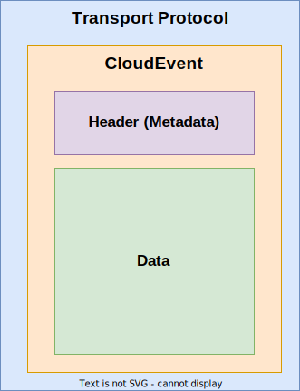

= CloudEvents
:toc:
:sectnums:

The key words "*MUST*", "*MUST NOT*", "*REQUIRED*", "*SHALL*", "*SHALL NOT*", "*SHOULD*", "*SHOULD NOT*", "*RECOMMENDED*", "*MAY*", and "*OPTIONAL*" in this document are to be interpreted as described in https://www.rfc-editor.org/info/bcp14[IETF BCP14 (RFC2119 & RFC8174)]

----
SPDX-FileCopyrightText: 2023 Contributors to the Eclipse Foundation

See the NOTICE file(s) distributed with this work for additional
information regarding copyright ownership.

This program and the accompanying materials are made available under
the terms of the Apache License Version 2.0 which is available at
https://www.apache.org/licenses/LICENSE-2.0
 
SPDX-FileType: DOCUMENTATION
SPDX-License-Identifier: Apache-2.0
----

== Overview

https://cloudevents.io/[CloudEvents] is a specification hosted by the https://cncf.io/[Cloud Native Computing Foundation] (CNCF) for describing events in a common way.

The CloudEvents specification defines an envelope for carrying information about the occurrence of a noteworthy event in a system.

.CloudEvents envelope

CloudEvents

* are self-contained & unique,
* contain standardized metadata in the header,
* contain optional context information in its data section,
* can be represented using different formats without losing/modifying information.

The metadata contained in an event covers questions like

* What kind of event has occurred?
* When did it occur?
* Where did it occur?
* What context did the event occur in?

Support for using CloudEvents is available for many programming languages by means of corresponding SDKs.

The https://cloudevents.io/[CloudEvents] project has defined a set of *Formats* which describe how events can be expressed using https://github.com/cloudevents/spec/blob/v1.0.2/cloudevents/formats/json-format.md[JSON], https://github.com/cloudevents/spec/blob/v1.0.2/cloudevents/formats/protobuf-format.md[Protobuf] or https://github.com/cloudevents/spec/blob/v1.0.2/cloudevents/formats/avro-format.md[Apache Avro].

The accompanying *Bindings* describe how events can be sent via well-known transport protocols like https://github.com/cloudevents/spec/blob/v1.0.2/cloudevents/bindings/http-protocol-binding.md[HTTP], https://github.com/cloudevents/spec/blob/v1.0.2/cloudevents/bindings/mqtt-protocol-binding.md[MQTT] etc.

[.specitem,oft-sid="dsn~cloudevents-umessage-mapping~2",oft-needs="impl,utest",oft-title="Mapping of UMessages to CloudEvents"]
== uMessage Mapping

uProtocol uses xref:../basics/umessage.adoc[UMessages] to exchange information between uEntities.
The following sections define the mapping between UMessages and CloudEvents.

=== uAttributes Mapping

The table below defines the mapping of uAttributes to CloudEvent attributes. This mapping *MUST* be used by uProtocol Transport Libraries which use CloudEvents for binding to a particular transport protocol.

.Mapping of uAttributes to CloudEvent properties
[width="100%",cols="12%,8%,10%,70%",options="header",]
|===
|uAttributes Property
|CloudEvent Attribute
|CE Type
|Description

| N/A
|https://github.com/cloudevents/spec/blob/v1.0.2/cloudevents/spec.md#specversion[`specversion`]
|String
a|CloudEvent specification version. This is *NOT* the uProtocol version

* *MUST* be set to `1.0`

|`type`
|https://github.com/cloudevents/spec/blob/v1.0.2/cloudevents/spec.md#type[`type`]
|String
a|The type of the message

* *MUST* be set to the value of the `uprotocol.ce_name` option defined for the
link:../up-core-api/uprotocol/uattributes.proto[UMessageType enum].

|`id`
|https://github.com/cloudevents/spec/blob/v1.0.2/cloudevents/spec.md#id[`id`]
|String
a|Unique identifier for the message

* *MUST* be set to the https://www.rfc-editor.org/rfc/rfc4122.html#section-3[hyphenated string representation] of the UUID.

|`source`
|https://github.com/cloudevents/spec/blob/v1.0.2/cloudevents/spec.md#source-1[source]
|Uri-Reference
a|The origin (address) of the message

* *MUST* be set to either the long or short form xref:../basics/uri.adoc[serialization of the URI]

|`sink`
|`sink`
|Uri-Reference
a|The destination (address) of the message

* *MUST* be set to either the long or short form xref:../basics/uri.adoc[serialization of the URI]

|`priority`
|`priority`
|String
a| The message's priority as defined by xref:../basics/qos.adoc[QoS].

* *MUST* be set to the value of the `uprotocol.ce_name` option defined for the
link:../up-core-api/uprotocol/uattributes.proto[UPriority enum].

|`ttl`
|`ttl`
|Integer
a|The amount of time (in milliseconds) after which this message MUST no longer be delivered/processed.

|`token`
|`token`
|String
a|The service consumer's access token.

|`permission_level`
|`plevel`
|Integer
|The service consumer's permission level as defined in xref:../basics/permissions.adoc#_code_based_access_permissions_caps[Code-Based uE Access Permissions (CAPs)]

|`reqid`
|`reqid`
|String 
a|The identifier that a service consumer can use to correlate an RPC Repsonse message with its RPC Request.

* MUST be set to the https://www.rfc-editor.org/rfc/rfc4122.html#section-3[hyphenated string representation] of the UUID.

|`commstatus`
|`commstatus`
|Integer
a|A code indicating an error that has occurred during the delivery of either an RPC Request or Response message.

* MUST be set to the link:../up-core-api/uprotocol/ustatus.proto[UCode]'s integer value

|`traceparent`
|https://github.com/cloudevents/spec/blob/v1.0.2/cloudevents/extensions/distributed-tracing.md#traceparent[traceparent]
|String
|A tracing identifier to use for correlating messages across the system.

|`payload_format`
|`pformat`
|Integer
|The value of the UPayloadFormat that is used to indicate the encoding of the payload (if any). The concrete mapping rules are defined in <<ce-formats>>.

|===

[#ce-formats]
=== uPayload Mapping

The sections below define the mapping of uPayload to CloudEvent attributes.

NOTE: The custom `pformat` property is used to indicate the payload type instead of the standard `datacontenttype` property defined by CloudEvents. Its value is set to the integer value assigned to the link:../up-core-api/uprotocol/uattributes.proto[UPayloadFormat]. This helps to reduce the size of the resulting data structure.

==== Mapping to CloudEvent Protobuf Format

The rules defined in https://github.com/cloudevents/spec/blob/v1.0.2/cloudevents/formats/protobuf-format.md[Protobuf Event Format for CloudEvents, Version 1.0.2] MUST be applied when mapping UPayload to CloudEvents using the Protobuf Format. The table below defines specific values to use for the different UMessage payload types.

This mapping *MUST* be used by uProtocol Transport Libraries which use the Protobuf Event Format for the binding to a particular transport protocol.

[%autowidth]
|===
|UPayloadFormat |CE `pformat` |CE `dataschema` |CE Property to map Payload Data to

|`UPAYLOAD_FORMAT_UNSPECIFIED`
|`-`
|*MAY* be set to a URI-Reference identifying the schema that the data adheres to
|`binary_data`

|`UPAYLOAD_FORMAT_PROTOBUF_WRAPPED_IN_ANY`
|`0x01`
|*MAY* be set to `type.googleapis.com/google.protobuf.Any`
|`proto_data`

|`UPAYLOAD_FORMAT_PROTOBUF`
|`0x02`
|*SHOULD* be set to the protobuf's type URL
|`proto_data`

|`UPAYLOAD_FORMAT_JSON`
|`0x03`
|*MAY* be set to a URI-Reference identifying the schema that the data adheres to
|`text_data`

|`UPAYLOAD_FORMAT_SOMEIP`
|`0x04`
|*MAY* be set to a URI-Reference identifying the schema that the data adheres to
|`binary_data`

|`UPAYLOAD_FORMAT_SOMEIP_TLV`
|`0x05`
|*MAY* be set to a URI-Reference identifying the schema that the data adheres to
|`binary_data`

|`UPAYLOAD_FORMAT_RAW`
|`0x06`
|*MAY* be set to a URI-Reference identifying the schema that the data adheres to
|`binary_data`

|`UPAYLOAD_FORMAT_TEXT`
|`0x07`
|*MAY* be set to a URI-Reference identifying the schema that the data adheres to
|`text_data`

|===

==== Mapping to CloudEvent JSON Format

The rules defined in https://github.com/cloudevents/spec/blob/v1.0.2/cloudevents/formats/json-format.md[JSON Event Format for CloudEvents, Version 1.0.2] MUST be applied when mapping UPayload to CloudEvents using the JSON Format. The table below defines specific values to use for the different UMessage payload types.

This mapping *MUST* be used by uProtocol Transport Libraries which use the JSON Event Format for the binding to a particular transport protocol.

[%autowidth]
|===
|UPayloadFormat |CE `pformat` |CE `dataschema` |CE Property to map Payload to

|`UPAYLOAD_FORMAT_UNSPECIFIED`
|`-`
|*MAY* be set to a URI-Reference identifying the schema that the data adheres to
|`data_base64`

|`UPAYLOAD_FORMAT_PROTOBUF_WRAPPED_IN_ANY`
|`0x01`
|*MAY* be set to `type.googleapis.com/google.protobuf.Any`
|`data_base64`

|`UPAYLOAD_FORMAT_PROTOBUF`
|`0x02`
|*SHOULD* be set to the protobuf's type URL
|`data_base64`

|`UPAYLOAD_FORMAT_JSON`
|`0x03`
|*MAY* be set to a URI-Reference identifying the schema that the data adheres to
|`data`

|`UPAYLOAD_FORMAT_SOMEIP`
|`0x04`
|*MAY* be set to a URI-Reference identifying the schema that the data adheres to
|`data_base64`

|`UPAYLOAD_FORMAT_SOMEIP_TLV`
|`0x05`
|*MAY* be set to a URI-Reference identifying the schema that the data adheres to
|`data_base64`

|`UPAYLOAD_FORMAT_RAW`
|`0x06`
|*MAY* be set to a URI-Reference identifying the schema that the data adheres to
|`data_base64`

|`UPAYLOAD_FORMAT_TEXT`
|`0x07`
|*MAY* be set to a URI-Reference identifying the schema that the data adheres to
|`data`

|===

==== Additional Recommendations

CloudEvents *SHOULD* only be serialized when they are about to be sent via the xref:README.adoc#_utransport[UTransport interface]

== Examples

The following examples are using the CloudEvent JSON Format.

=== Publish
[source, json]
----
{
    "specversion": "1.0",
    "id": "cf8b1bcd-30bd-43be-a8d3-ad1cde652e10",
    "source": "//VCU.VIN/body.access/1/door.front_left#Door",
    "type": "up-pub.v1",
    "priority": "CS1",
    "ttl": 10000,
    "pformat": 7,
    "data": "open"
}
----

=== Notification
[source, json]
----
{
    "specversion": "1.0",
    "id": "cf8b1bcd-30bd-43be-a8d3-ad1cde652e10",
    "source": "//VCU.VIN/body.access/1/door.front_left#Door",
    "sink": "//VCU.VIN/companion.app/1/status.update",
    "type": "up-not.v1",
    "pformat": 3,
    "data": {
        "subject": "door.front_left",
        "status": "open"
    }
}
----

=== Request
[source, json]
----
{
    "specversion": "1.0",
    "id": "cf8b1bcd-30bd-43be-a8d3-ad1cde652e10",
    "source": "//VCU.VIN/MyApp/1/rpc.response",
    "sink": "//VCU.VIN/body.access/1/rpc.UpdateDoor",
    "type": "up-req.v1",
    "priority": "CS4",
    "ttl": 50000,
    "pformat": 1,
    "data_base64": "... base64 encoded serialization of UpdateDoorRequest packed
                        in google.protobuf.Any ..."
}
----

=== Response
[source, json]
----
{
    "specversion": "1.0",
    "id": "5b9fe861-8c1c-4899-9b07-ad1cde652e10",
    "source": "//VCU.VIN/body.access/1/rpc.UpdateDoor",
    "sink": "//VCU.VIN/MyApp/1/rpc.response",
    "type": "up-res.v1",
    "priority": "CS4",
    "reqid": "cf8b1bcd-30bd-43be-a8d3-ad1cde652e10",
    "ttl": 50000,
    "pformat": 2,
    "dataschema": "type.googleapis.com/google.rpc.Status",
    "data_base64": "... base64 encoded serialization of google.rpc.Status ..."
}
----
