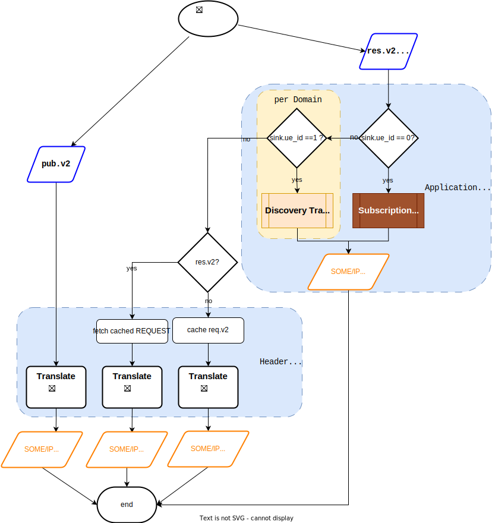
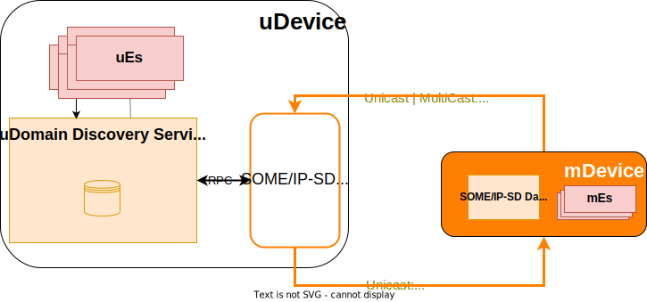
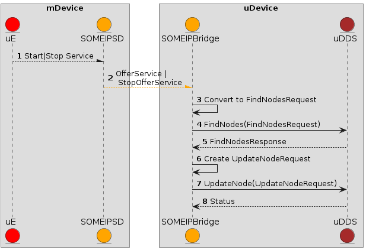
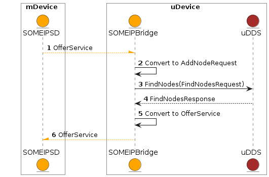
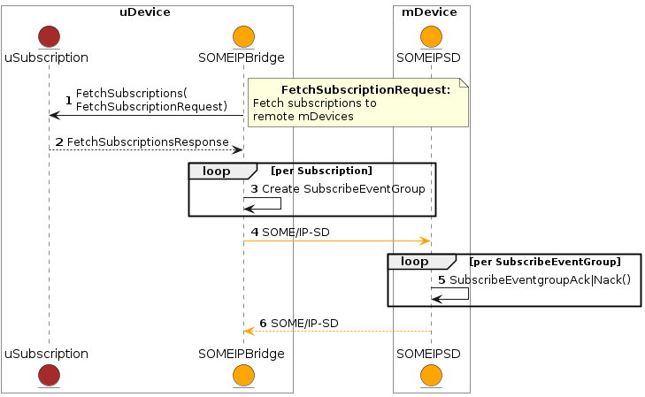
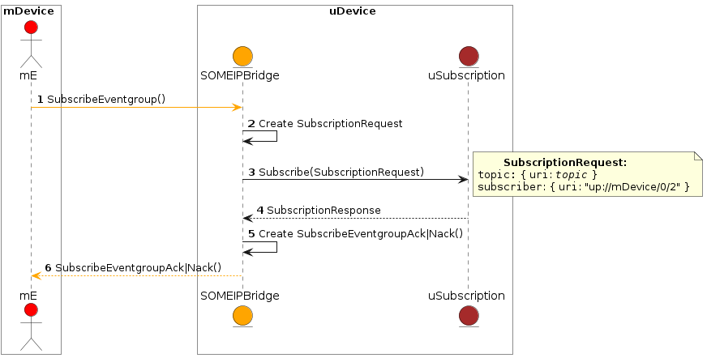
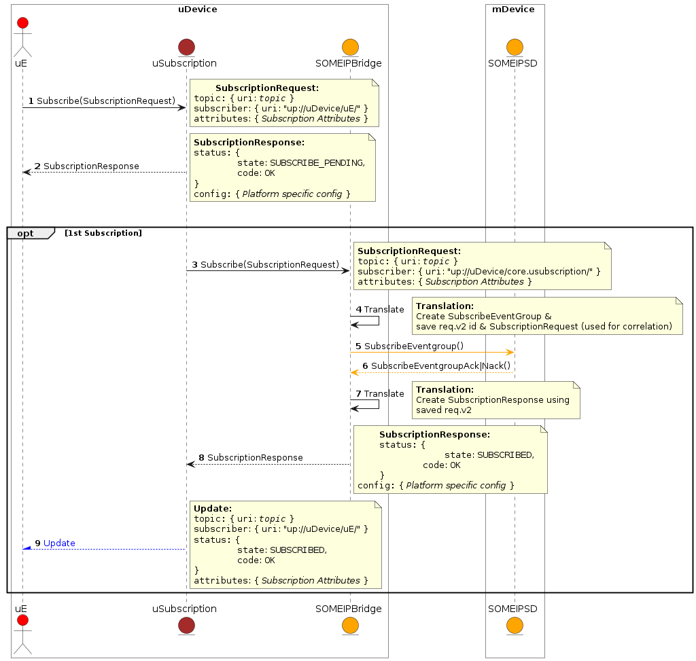
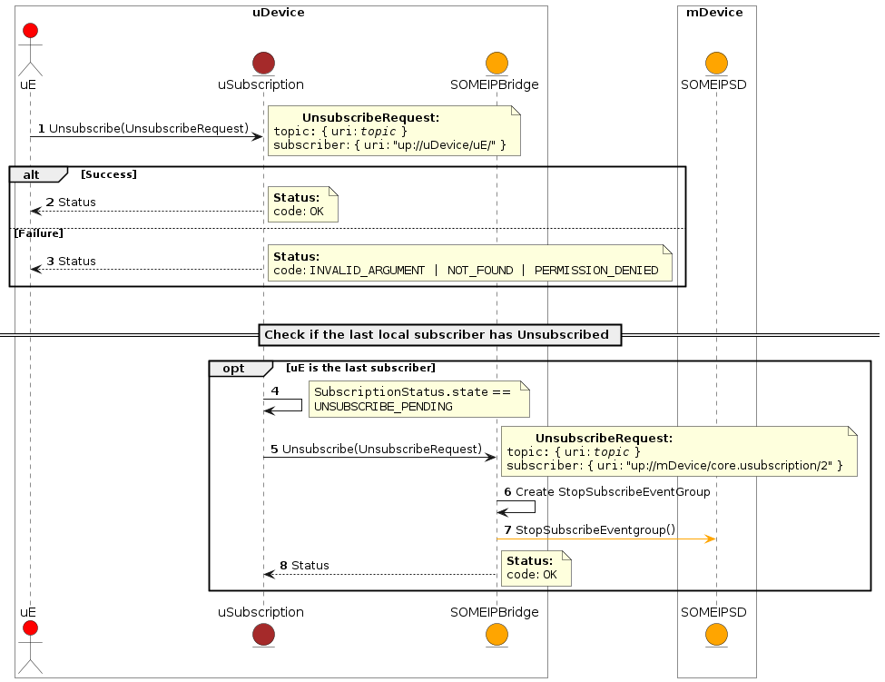
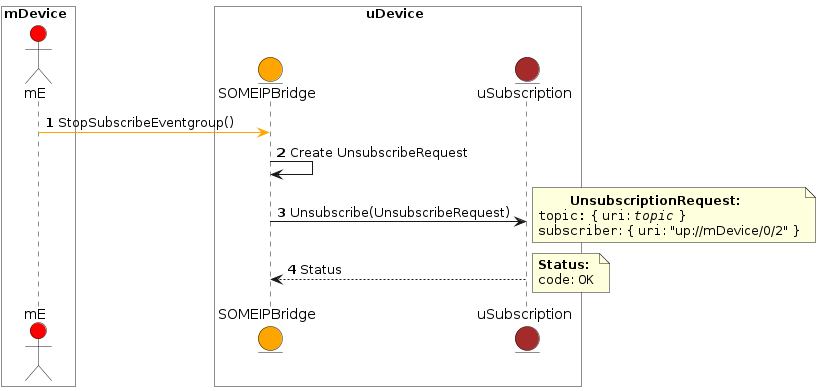

= SOME/IP uProtocol Bridge
:toc:
:sectnums:
:plantuml-server-url: http://www.plantuml.com/plantuml
:github-plantuml-url: https://github.com/plantuml/plantuml-server/raw/master/dist

The key words "*MUST*", "*MUST NOT*", "*REQUIRED*", "*SHALL*", "*SHALL NOT*", "*SHOULD*", "*SHOULD NOT*", "*RECOMMENDED*", "*MAY*", and "*OPTIONAL*" in this document are to be interpreted as described in https://www.rfc-editor.org/info/bcp14[IETF BCP14 (RFC2119 & RFC8174)]

----
Licensed to the Apache Software Foundation (ASF) under one
or more contributor license agreements.  See the NOTICE file
distributed with this work for additional information
regarding copyright ownership.  The ASF licenses this file
to you under the Apache License, Version 2.0 (the
"License"); you may not use this file except in compliance
with the License.  You may obtain a copy of the License at

  http://www.apache.org/licenses/LICENSE-2.0

Unless required by applicable law or agreed to in writing,
software distributed under the License is distributed on an
"AS IS" BASIS, WITHOUT WARRANTIES OR CONDITIONS OF ANY
KIND, either express or implied.  See the License for the
specific language governing permissions and limitations
under the License.
----

== Purpose

uProtocol, is a layered communication
protocol to enable applications and services, running in different
devices, to seamlessly communicate with each other regardless of the
underlining automotive or Internet protocols. uProtocol provides a
common messaging framework to support RPC, notification, and pub/sub
architecture patterns between software entities (uEs). uProtocol
includes application layer core services
link:../../up-l3/usubscription/v2/README[uSubscription] and
link:../../up-l3/udiscovery/v2/README[uDiscovery]
that help provide the ability for subscription management and discovery
of uEs respectively.

SOME/IP, developed by AUTOSAR, is another
parallel communication protocol, similar to uProtocol, that also
supports rpc, notification, and pub/sub
patterns targeted for embedded
automotive software, optimized for low footprint microcontrollers.

Today there is no way to bridge the two protocols with each other, this
means that applications and services whom communicate over SOME/IP
cannot communicate with applications and services outside of automotive
(ex. cloud, mobile, etc...). This is a major limitation for automotive.

The purpose of this proposal shall be to elaborate on how uProtocol can
be bridged with SOME/IP such that software can seamlessly communicate
across the different protocols.

== Background

=== Definition of Terms

.Definition of Terms
|===
|Term |Definition

|https://en.wikipedia.org/wiki/Protocol_data_unit[*PDU*] |Protocol Data
Unit is a single unit of information transmitted among peer entities of
a computer network. for the purpose of this document we shall refer to
the SOME/IP messages sent over TCP/UDP as PDU.  

|*SOME/IP* |*Scalable service-Oriented MiddlewarE over IP* specifies the
format, message sequences and semantics of the AUTOSAR Protocol 

|*SOME/IP-SD* |Service Discovery portion of the AUTOSAR SOME/IP standard

|*uDevice* |Device that implements uProtocol and contains the required
Core Platform uEs (uSubscription, uDiscovery) and uDispatchers (uBus,
uStreamer, etc...)

|*mDevice* |Device that implements SOME/IP and SOME/IP-SD protocols and
includes the SOME/IP-SD daemon

|*uE* |uProtocol Software Entity deployed to uDevices that can be a
producer (uService) or consumer (uApp)

|*mE* |uProtocol Mechatronic Software Entity deployed on mDevices that
can be a producer (uService) or consumer (uApp). mEs are also referred
to as SWEs in AUTOSAR specifications, we use this different term to
differentiate a SWE that is declared in protobuf vs a SWE that is
declared using ARXML and Rhapsody modeling (a.k.a mService in other
documents). 
|===

== Overview

.SOME/IP Bridge Architecture
image:overview.drawio.svg[architecture] below provides a high level Concept for SOME/IP to
uProtocol translation that shall be covered in this specification.  

*Concept Summary:*

* Every uDevice will have a SOME/IP bridge
* SOME/IP bridge converts uProtocol messages (request,
response, publish, notify) to SOME/IP messages (REQUEST, RESPONSE, NOTIFICATION, ERROR)
* SOME/IP bridge also performs application layer translation (payload
translation) to convert uSubscription & uDiscovery to SOMEIP/SD
* Given the recursive lookup and replicated storage functionality built
into uDiscovery (uLDS → uDDS → uCDS), only one uDevice within a domain
(vehicle) is required to translate Discovery portion of SOME/IP-SD to
uDiscovery (see link:#SDV20014Eclipse-DiscoveryTranslation[Discovery
Translation] for more details)

This specification shall be split up into the three layers of uProtocol
and how each layer maps (translates) to SOME/IP. 

== SOME/IP Transport Layer (uP-L1)

Transport layer is responsible to specify how messages (CloudEvents) are
sent and received over a "wire" between uEs or between devices. In this
section we will cover the SOME/IP communication protocol binding
(connect, send/receive of messages), and event mapping (converting
SOME/IP messages to uProtocol CloudEvent messages).  

SOME/IP protocol communicates over UDP and TCP connections to specific
sockets that are explained in SOME/IP specifications. readers are
strongly recommended to familiarize themselves with the required
background material mentioned on these pages as the content will not be
duplicated. 

* All SOME/IP communication (sockets) *SHALL* be terminated by the
SOME/IP bridge, this is because the bridge shall translate the SOME/IP
protocol to uProtocol
* SOME/IP Bridge *SHALL* be the only uE that listens on the protocol
specific sockets and multicast address per the SOME/IP protocol
specifications
* Request/Response messages *SHOULD* be sent over TCP to guarantee
at-least-once deliver. When designing the mDevice services, it is
recommended that the service architect read and review Protocol usage
and guidelines of SOME/IP.
* Published events *MAY* be sent over UDP

---

== Message Translations (uP-L2) 

In the following section we shall elaborate on how uProtocol headers
(CloudEvents metadata) are mapped to SOME/IP headers.

*NOTE:* Protocol source and sink attributes are represented in URI
format.  Version 1 of the uProtocol Cloudevents use long form URIs while
version 2 of the events use short form URIs with IDs in lieu of names
for services, topics, authorities, methods, etc... Long form URIs
require name resolution through the discovery when used with SOME/IP
protocol whereas v2 event types do not. For more information on short vs
long form URIs and v2 events, please refer to
file:///C:\display\UL\SDVA-1496:+v2+CloudEvents[[3]]. This document
shall assume v2 events are used when communicating with mDevices 

=== Overview

<<up-2-someip>> and <<someip-2-up>> below illustrate how messages are
 are converted to and from the different
protocols by the bridge. 

.uProtocol to SOME/IP Translation
 

.SOME/IP to uProtocol Translation
image:someip_to_up.drawio.svg[someip-2-up] 

=== Attribute Mapping

=== URIs

link:#SDV-20014Eclipse-CAPTION-OD8NO[[.underline]#Table#
[.underline]#2#: [.underline]#Sink &amp; Source URI Mapping#] below
highlights the URI to SOME/IP fields mapping that apply to all event
types. For more information about uProtocol URIs please refer to

Error rendering macro 'caption-ref' : Caption with anchor=EVWQ1 could
not be found.

.Sink & Source URI Mapping
[sink-source-uri-mapping]
|===
|*URI Portion* |*SOME/IP Field* |*Description*
|*authority* |IP address & port |IP address & port (destination
endpoint) of the mDevice

|*UE_ID* |Service ID |Software entity ID that is placed in the upper 16
bits of the SOME/IP Message ID header field

|*METHOD_ID* |Method ID |Identifier of the method/resource placed in the
lower 16 bits of the SOME/IP Message ID header field

|*RESOURCE_ID* |Event ID |
|===

==== IDs

ID are used for identification of uProtocol messages as well as to
correlate an RPC request to the response for both uProtocol and
SOME/IP.  The format of IDs per protocol is described in
<<protocol-ids>> below.

.Protocol IDs
[protocol-ids]
|===
|Protocol |Type |Definition

|*uProtocol* |128 bit UUIDv8 |

|*SOME/IP* |32 bits: 16 bit Client ID + 16 bit Session ID
|4.1.2.4
|===

* Generated uProtocol events *MUST* follow UUIDv8
requirements
* Generated SOME/IP events *SHOULD* set the 16 bit client ID to 0 per
SOME/IP specifications 4.1.2.4
* *MUST* auto-populate the request ID cached from the request event,
into the response event and then flush the entry in the cache

Further details of the usage of IDs for the various message types can be
found in the next section.

==== Message Type

===== Publication/Notification

.Publication/Notification
[publication-notification]
|===
|CE Attribute |uProtocol Value |SOME/IP Value |Details

|*type* |4 |NOTIFICATION |Both publication and notifications events are
sent using this type

|*id* |UUIDv8 |N/A |SOME/IP
notifications (published events) do not have IDs
|===

===== Request

Below are some special requirements for handling RPC event flows by the
SOME/IP Bridge:

* *MUST* cache (non-persistent) the ingress (source) request IDs from
the protocol requests events for a maximum of TTL specified in the
protocol
* *MUST* auto-generate a request ID of the destination protocol
specifications (sink) and store this sink request ID with the source
request ID in a map
* Auto-generated uProtocol req.v2 message, *MUST* follow UUIDv8
requirement
* Auto-generated SOME/IP REQUEST message, *MAY* set the 16 bit client ID
to the 0 per SOME/IP specifications 
* *MUST* auto-populate the request ID cached from the request event,
into the response event and then flush the entry in the cache

.Request Event Type
[request-event-type]
|===
|CE Attribute |uProtocol Value|SOME/IP Value |Details

|*type* |7 |0x0 (REQUEST) |

|*id* |See <<protocol-ids>> for more details | a|
* *MUST* cache ingress request identifier for a maximum of TTL specified
in the ingress messages 

|===

===== Response

.Response Event Type
[response-event-type]
|===
|CE Attribute |uProtocol Value |SOME/IP Value |Details

|*type* |*8* |0x80 (RESPONSE) |RPC Response that does not contain
commstatus (communication error or any thrown exceptions by the
service)

| |*8* |0x81 (ERROR) a|
Error has occurred while attempting to deliver the message or a service
has thrown an exception

!===
!commstatus (google.rpc.Code) !SOME/IP Error Codes

!OK !E_OK
!INVALID_ARGUMENT !E_WRONG_MESSAGE_TYPE !E_UNKNOWN_METHOD
!DEADLINE_EXCEEDED !E_TIMEOUT
!NOT_FOUND !E_UNKNOWN_SERVICE
!UNAVAILABLE !E_NOT_READY
!DATA_LOSS !E_MALFORMED_MESSAGE
!INTERNAL !E_NOT_REACHABLE
!===

|*reqid* |See <<protocol-ids>> for more details a|
* *MUST* be the cached request identifier from the ingress associated
request message (i.e the uProtocol req.v2:id or SOME/IP
REQUEST:request_id message)

|
|===

---

== Application Layer Translation

Application (or message payload) translation is the process of
converting SOME/IP-SD logic to/from uDiscovery and uSubscription. In the
following section we will elaborate on the details of these translation.

=== Discovery Translation

The following figure provides a high level overview of how discovery shall function between protocols.

.Discovery Translation
[discovery-translation,align="center"]

Given that uProtocol has built in hierarchical discovery resolution
functionality (uLDS → uDDS → uCDS), application layer translation of
discovery logic shall be done once per-vehicle at the domain level.
Details of the flows shall be covered in this section. Additionally:

* mDevices SOME/IP-SD daemon *MUST* advertise supported services by
sending OfferService and StopService messages
* The uDevice that implements uDDS *MUST* implement SOME/IP-SD handle
discovery protocol with mDevices 
* uEs talk to their LDS to discovery services running on
mDevices
* mEs running on mDevices send FindService messages to the SOME/IP-SD
bridge to discovery uEs
* mDevices *SHALL* resolvable (authority portion) to static IP address
known to the vehicle

==== mE Advertisement

mEs are advertised through the SOME/IP-SD OfferService and
StopOfferService messages. These messages flow from mDevices to the
SOME/IP-SD Bridge on uDevices and converted to information that is
populated inside of the uDiscovery database. The advertisement flow is
illustrated in <<advertisement-of-mdevice-services>>
below. 

.Advertisement of mDevice Services
[advertisement-of-mdevice-services]

* mDevice SOME/IP-SD Daemon *MUST* populate the IPv4 and/or IPv6
Endpoint Options (5.1.2.4), this is used
to know the location (authority) for where the service is located 

===== Discovery Flows

====== mEs Discovering uEs

.mEs Discovering uEs
[mes-discovering-ues]

====== uEs Discovering mEs

A uE shall discovery mEs the same way that it discovers other uEs today
by querying the uLDS

==== Subscription Translation

In the following section we expand on the link:../../up-l3/usubscription/v2/README.adoc[uSubscription
Flows] between devices for both Subscribe() and unsubscribe()
operations. In summary, subscribing to
mDevice topics will follow the same design pattern as subscribing to
other uDevice topics that is:

* uSubscription service running on uDevices *SHALL* maintain a list of
local uE subscribers per mDevice topics (same behavior as if subscribing
to topics on other uDevices)
* The subscriber *SHALL* be the uSubscription service, this allows the
uBus to fan out the events by looking up the subscriptions in the
database

*TODO:* Mapping of SubscribeAttributes with SOME/IP-SD options (if
needed)

===== Message Translation

The following section we will elaborate on how Eventgroup Entry types
(5.1.3.1) are mapped to uSubscription messages for the subscribe
and unsubscribe flows. 

*NOTE:* The SubscribeRequest::topic::authority is used to identify which
mDevice we wish to send the SOME-IP/SD:SubscribeEventGroup message to.

.Protocol Message Map
[protocol-message-map,width=70%]
|===
|SOME/IP Eventgroup Type |uSubscription Message Type

|*SubscribeEventgroup* |SubscriptionRequest 
|*StopSubscribeEventgroup* |UnsubscribeRequest
|*SubscribeEventgroupAck* |SubscriptionResponse (status.code==OK)
|*SubscribeEventgroupNack* |SubscriptionResponse (status.code==UNKNOWN)
|===

.Eventgroup Entry Field Description
[eventgroup-entry-field-description,width=100%,cols="20,20,20,40"]
|===
|Eventgroup Entry Field |uP field |uP Sub-Field |Notes

|Service ID |Topic |UE_ID |per link:#SDV20014Eclipse-URIMapping[URI
Mapping]

|Major Version | |UE_VERSION |Major number from UE_VERSION only

|Eventgroup ID | |RESOURCE_ID |*SHALL* be the Id that is assigned to the
topic in proto files for the mE/uE

|Instance ID |N/A | |*SHALL* assume to be 0

|Minor Version |N/A | |*SHALL* assume version 0 to match uProtocol
backwards compatibility requirements

|TTL |SubscribeAttributes |ttl |*SHALL* set to 0xFFFFFF to indicate that
the subscription should remain for the duration of the ignition cycle 

|IPv4 (and/or IPv6) Endpoint Option |SubscriberInfo.uri |Authority
|*SHALL* set to the IPv4 (and/or IPv6) address(s) and port of the
SOME/IP Bridge that is sending the SubscribeEventGroup message to the
mDevice, this is used to tell the mE where it must multicast the
published events (SOME/IP::NOTIFICATION) to.

|N/A | |UE_ID |*SHALL* be set to 0 when subscriber is core.usubscription
(uProtocol)
|===

===== Initialization Flow

Per SOME/IP-SD specifications, subscriptions do not persist from one
ignition cycle to the next, this means that the uDevice (and the SOME/IP
bridge) *MUST* re-subscribe to all active subscription topics of the
remote mDevices whenever it re-initializes. The above mentioned sequence
shall be illustrated in the diagram below. 

.Initialization Flow
[subscribe-init]

===== Subscribe Flow

====== uDevice to mDevice

.uDevice to mDevice Subscription Flow
[udevice-to-mdevice-subscription-flow]

====== mDevice to uDevice

.mDevice to uDevice Subscription Flow
[mdevice-to-udevice-subscription-flow]

===== Unsubscribe Flow

====== uDevice to mDevice

.uDevice to mDevice unSubscribe
[udevice-to-mdevice-unsubscribe]

====== mDevice to uDevice

.mDevice to uDevice unSubscribe
[mdevice-to-udevice-unsubscribe]

===== Fetching Subscriptions

TODO: Per the SOME/IP-SD protocol, subscriptions are only suppose to
persist till the end of the ignition cycle so there is no way to fetch
persistent subscriptions from mDevices. 

