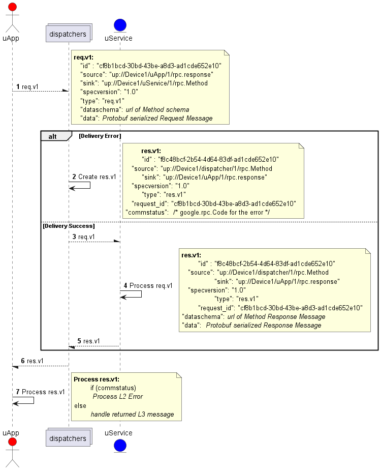

= Dispatching
:toc: preamble
:sectnums:

The key words "*MUST*", "*MUST NOT*", "*REQUIRED*", "*SHALL*", "*SHALL NOT*", "*SHOULD*", "*SHOULD NOT*", "*RECOMMENDED*", "*MAY*", and "*OPTIONAL*" in this document are to be interpreted as described in https://www.rfc-editor.org/info/bcp14[IETF BCP14 (RFC2119 & RFC8174)]

----
SPDX-FileCopyrightText: 2023 Contributors to the Eclipse Foundation

See the NOTICE file(s) distributed with this work for additional
information regarding copyright ownership.

This program and the accompanying materials are made available under
the terms of the Apache License Version 2.0 which is available at
https://www.apache.org/licenses/LICENSE-2.0
 
SPDX-FileType: DOCUMENTATION
SPDX-License-Identifier: Apache-2.0
----

== Overview

Like IP packets, xref:../../basics/umessage.adoc[uProtocol messages] (UMessage) have a source and a sink attribute which indicate the origin and the destination of the message respectively. These attributes are used to route UMessages from one uProtocol Entity (uEntity) to the next if the destination is not the receiving uEntity.

NOTE: The terms _dispatcher_ and _router_ will be used synonymously in the remainder of the document.

A UMessage contains data (the payload) as well as meta data describing the nature of the payload. One of the core principles of uProtocol is that the data portion of a UMessage does not need to be examined by message routers, this is very similar to how most Internet standards work today. Only the source uEntity that originally created the message and the sink uEntity(s) which will eventually consume the message need to understand/analyze the payload of the UMessage.

To be able to forward/dispatch/route UMessages through the network, we must define specific purpose built uEntities to perform these tasks (ex. Ethernet switches, IP routers, etc...). Platform uEntities that are responsible for event dispatching and implementing the communication layer are described in the sections below. We will elaborate on these specific uEntities in the Platform uEntities section below.

.Types of Dispatchers
[#dispatcher-types,width=100%",cols="30%,70%"]
|===
|Dispatcher uEntities | Description

|*uBus*
|Message bus that dispatches UMessages between uEntities over a common transport. It provides multicast and forwarding functionality (works like a network switch)

|*uStreamer*
|Provides Device-2-Device UMessage routing either using the same or different transport protocols , i.e. when events need to move form one transport to the next it flows through the streamer (can be equated to an IP router)

|*Cloud Gateway*
|A uEntity that sits at the edge of the cloud to connect non-cloud devices (ex. vehicles, phones, etc...) to the cloud

|*Device Proxy Router (DPR)*
|A uEntity that proxies UMessages between devices that are not able to directly communicate with each other
|===

.Dispatchers
image::dispatchers.drawio.svg[Dispatchers]

== Requirements

In this section we will elaborate on the requirements of the platform Dispatchers (uBus, uStreamer, etc...) and their role in message delivery. Dispatchers build upon the transport layer delivery requirement assumptions.

NOTE: These communication layer requirements are still for point-2-point uEntity communication to and from a dispatcher

* *MUST* support At-least-once delivery policy, this means that the dispatcher will make every attempt to dispatch the UMessage to the intended Receiver
  ** *MUST* queue UMessages not successfully acknowledged (transport level at-least-once delivery confirmation described above)
  ** *MUST* attempt to retry transmission of the UMessage. Retry policy is specific to the dispatcher implementation
  ** Dispatcher *MUST NOT* discard UMessages unless either UMessage has expired, or the egress queue is full. UMessages that cannot be delivered are sent to a Dead Letter Office Topic

* *MAY* support additional UMessage delivery policies in general or per topic in the future
* *SHOULD* maintain the (relative) order that messages have been received in, when dispatching messages to receivers
* *SHOULD* consider a received UMessage's xref:../../basics/upriority.adoc[priority class] in their message dispatching strategy
* *MAY* batch UMessages when delivering to the Receiver
* UMessages that cannot be delivered *MUST* be sent to the Dead Letter topic (DLT)
  ** DLT *MUST* include at least the UMessage header, SHOULD contain the full UMessage
  ** DLT *MUST* include the reason for the failed delivery attempt using  error codes defined in google.rpc.Code
  ** uEntities MUST be able to subscribe to the DLT to be notified of message deliver failures
* *MUST* forward attributes from the UMessage header

If the uP-L1 delivery method is push:

* *SHALL* provide an API to start/stop dispatching of UMessages per-topic, this is to avoid having to queue UMessages on the Receiver if the Receiver is not ready to receive the UMessages

== RPC Error Handling

When a dispatcher is unable to dispatch an event for a given reason (queue full, etc...), the dispatcher is responsible to generate an RPC Response message and send it to the originator of the request. The status code is populated in the  link:../messages/v1/README.adoc#_response_message[`commstatus`] attribute of the response message using the <<commstatus-codes>> defined below.

.commstatus Codes
[#commstatus-codes]
[width="100%",cols="30%,60%",options="header",]
!===
|*google.rpc.Code* |*Reason*

|`*UNAVAILABLE*`
|The service is not available (at the moment), e.g. because the device that the service is deployed to is being restarted. The client MAY retry the request but SHOULD use an exponential back-off for doing so.

|`*DEADLINE_EXCEEDED*`
|The time-to-live set in the client's request has expired.

|`*PERMISSION_DENIED*`
|The client is not authorized to invoke the service operation.

|`*UNAUTHENTICATED*`
|The credentials provided by the client could not be verified, e.g. because the client's identity does not match the source attribute.

|`*RESOURCE_EXHAUSTED*`
|The dispatcher ran out of resources, e.g. because a message queue's maximum capacity has been reached.

|`*INVALID_ARGUMENT*`
|The service can not process the request message, e.g. because an attribute or the payload does not have the expected format.

|`*UNKNOWN*`
|An unknown (but not critical) error has occurred.

|`*INTERNAL*`
|A serious error has occurred that is not covered by any of the error codes mentioned above.
!===

<<rpc-error-flow>> figure below illustrates the sequence of messages for RPC flows and the role dispatchers play in error handling.

.RPC Error Flow
[#rpc-error-flow]

