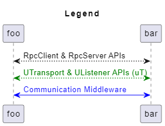
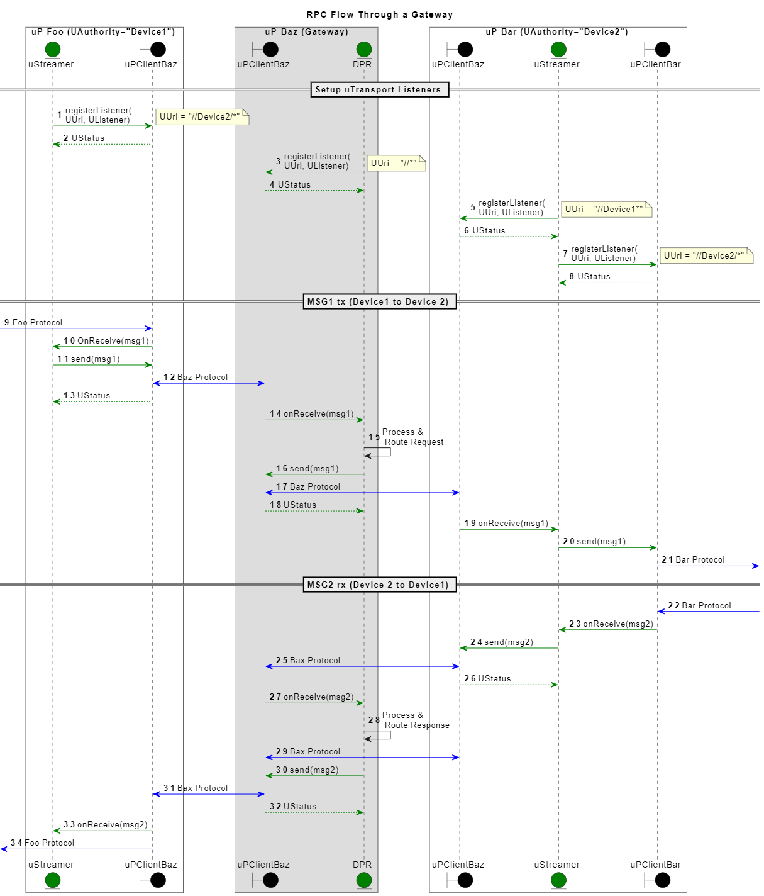

= Dispatching
:toc:
:sectnums:

The key words "*MUST*", "*MUST NOT*", "*REQUIRED*", "*SHALL*", "*SHALL NOT*", "*SHOULD*", "*SHOULD NOT*", "*RECOMMENDED*", "*MAY*", and "*OPTIONAL*" in this document are to be interpreted as described in https://www.rfc-editor.org/info/bcp14[IETF BCP14 (RFC2119 & RFC8174)]

----
Copyright (c) 2023 General Motors GTO LLC

Licensed to the Apache Software Foundation (ASF) under one
or more contributor license agreements.  See the NOTICE file
distributed with this work for additional information
regarding copyright ownership.  The ASF licenses this file
to you under the Apache License, Version 2.0 (the
"License"); you may not use this file except in compliance
with the License.  You may obtain a copy of the License at

  http://www.apache.org/licenses/LICENSE-2.0

Unless required by applicable law or agreed to in writing,
software distributed under the License is distributed on an
"AS IS" BASIS, WITHOUT WARRANTIES OR CONDITIONS OF ANY
KIND, either express or implied.  See the License for the
specific language governing permissions and limitations
under the License.

SPDX-FileType: DOCUMENTATION
SPDX-FileCopyrightText: 2023 General Motors GTO LLC
SPDX-License-Identifier: Apache-2.0
----

Like IP packets, uProtocol messages (CE) have a source attribute (originator of the message) and sink attribute (where should the message be sent to). These attributes are used to route the CEs from one uE to the next if the destination is not the receiving uE.

NOTE: Dispatcher and router shall be used For the remainder of this document we will use the term dispatcher and router interchangeably.

The header contains information for routing as well as metadata (of the data). One of the core principles of uProtocol is that the data portion of CE *MUST* be untouched by message routers, this is very similar to how most Internet standards work today. Only the source who generated the CE and the sink who will consume the CE needs to understand/analyze the payload of the CE.

To be able to forward/dispatch/route CEs through the network, we must define specific purpose built uEs to perform these tasks (ex. Ethernet switches, IP routers, etc...). Platform uEs that are responsible for event dispatching and implementing the communication layer are described in the sections below. We will elaborate on these specific uEs in the Platform uEs section below.

.Dispatchers
[width=100%",cols="30%,70%"]
|===
|Dispatcher uEs | Description

|*uBus*
|Message bus that dispatches CEs between uEs over a common transport. It provides multicast and forwarding functionality (works like a network switch)

|*uStreamer*
|Provides Device-2-Device CE routing either using the same or different transport protocols , i.e. when events need to move form one transport to the next it flows through the streamer (can be equated to an IP router)

|*Cloud Gateway*
|A uE that sits at the edge of the cloud to connect non-cloud devices (ex. vehicles, phones, etc...) to the cloud

|*Device Proxy Router (DPR)*
|A uE that proxies CEs between devices that are not able to directly communicate with each other
|===

.Dispatchers
image::dispatchers.drawio.svg[Dispatchers]

== Requirements
In this section we will elaborate on the requirements of the platform Dispatchers (uBus, uStreamer, etc...) and their role in message delivery. Dispatchers build upon the transport layer delivery requirement assumptions.

NOTE: These communication layer requirements are still for point-2-point uE communication to and from a dispatcher

* *MUST* support At-least-once delivery policy, this means that the dispatcher will make every attempt to dispatch the CE to the intended Receiver
  ** *MUST* queue CEs not successfully acknowledged (transport level at-least-once delivery confirmation described above)
  ** *MUST* attempt to retry transmission of the CE. Retry policy is specific to the dispatcher implementation
  ** Dispatcher *MUST NOT* discard CEs unless either CE has expired (CE.ttl), or the egress queue is full. CEs that cannot be delivered are sent to a Dead Letter Office Topic

* *MAY* support additional CE delivery policies in general or per topic in the future
* *SHOULD* dispatch in order that it received the CE
* *MAY* batch CEs when delivering to the Receiver
* CEs that cannot be delivered *MUST* be sent to the Dead Letter topic (DLT)
  ** DLT *MUST* include at least the CE header, SHOULD contain the full CE
  ** DLT *MUST* include the reason for the failed delivery attempt using  error codes defined in google.rpc.Code
  ** uEs MUST be able to subscribe to the DLT to be notified of message deliver failures

If the uP-L1 delivery method is push:

* *SHALL* provide an API to start/stop dispatching of CEs per-topic, this is to avoid having to queue CEs on the Receiver if the Receiver is not ready to receive the CEs

== RPC Error Handling

When a dispatcher is unable to dispatch an event for a given reason (queue full, etc...), the dispatcher is responsible to generate an RPC Response message and send it to the originator of the request. The status code is populated in the  link:../messages/v1/README.adoc#_response_message[`commstatus`] attribute of the response message using the <<commstatus-codes>> defined below.

.commstatus Codes
[#commstatus-codes]
[width="100%",cols="30%,60%",options="header",]
!===
|*google.rpc.Code* |*Reason*

|`*UNAVAILABLE*`
|The req.v1 has expired due to the downstream uE was unavailable (ex. uDevice was disconnected). uE that issued the req.v1 MAY retry with back-off

|`*DEADLINE_EXCEEDED*`
|CE has timed out per the ttl attribute specifications defined in req.v1 event

|`*PERMISSION_DENIED*`
|source is not permitted to access sink

|`*UNAUTHENTICATED*`
|source does not have valid authentication credentials (ex. uE's identity does not match the source attribute)

|`*RESOURCE_EXHAUSTED*`
|The dispatcher ran out of resources (buffer full)

|`*INVALID_ARGUMENT*`
|Invalid CE header attributes not covered above (ex. any mal-formatted attributes)

|`*UNKNOWN*`
|An unknown (but not critical) error has occurred

|`*INTERNAL*`
|There is a serious error has occurred not described by error codes mentioned above
!===

== Streamers
TODO: Fill in this section with more informational details

.Legend

=== Building uStreamers using uTransport APIs
<<streamer-flow>> diagram below illustrates how the uTransport APIs are used to build a uStreamer. The uTransport APIs are used to send/receive UMessages over the underlining communication middleware. The uStreamer is responsible for routing the UMessages to the appropriate uE based on the UMessage header attributes.

.Streamer Flows using uTransport

=== RPC Flows
<<rpc-flow>> diagram below illustrates how the uPClient RpcClient & RpcServer interfaces are then connected to the uTransport such that a transport can send/receive the UMessages over the underlining communication middleware 
.Rpc Flows
image:rpc_flow.png[#rpc_flow]