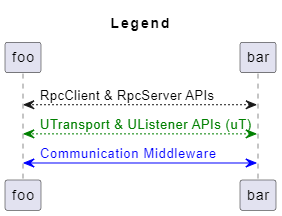
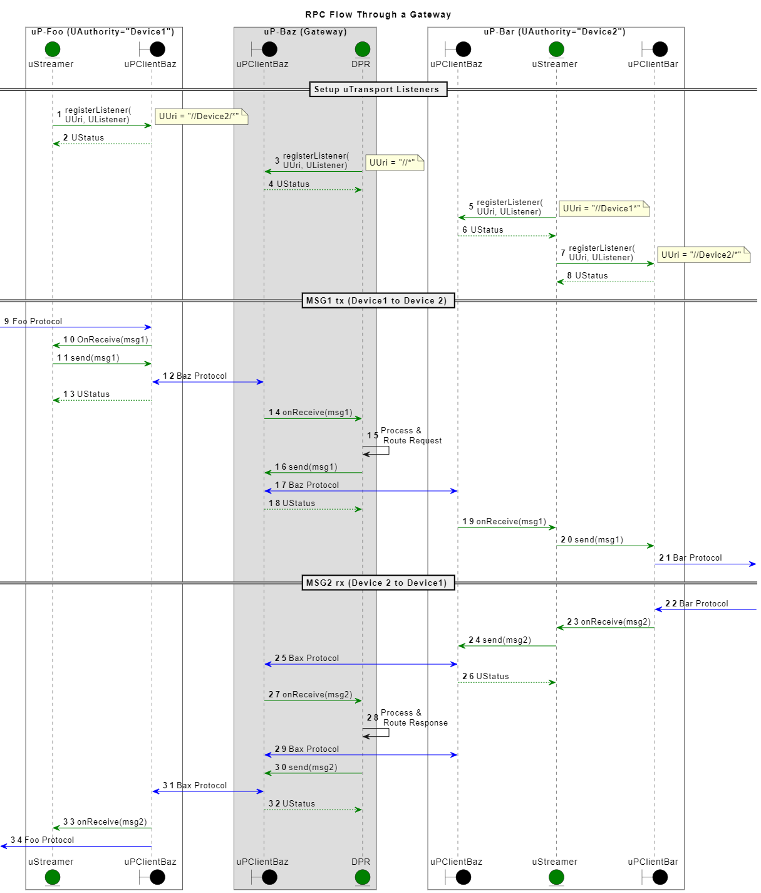

= uStreamer
:toc:
:sectnums:

The key words "*MUST*", "*MUST NOT*", "*REQUIRED*", "*SHALL*", "*SHALL NOT*", "*SHOULD*", "*SHOULD NOT*", "*RECOMMENDED*", "*MAY*", and "*OPTIONAL*" in this document are to be interpreted as described in https://www.rfc-editor.org/info/bcp14[IETF BCP14 (RFC2119 & RFC8174)]

----
Copyright (c) 2023 General Motors GTO LLC

Licensed to the Apache Software Foundation (ASF) under one
or more contributor license agreements.  See the NOTICE file
distributed with this work for additional information
regarding copyright ownership.  The ASF licenses this file
to you under the Apache License, Version 2.0 (the
"License"); you may not use this file except in compliance
with the License.  You may obtain a copy of the License at

  http://www.apache.org/licenses/LICENSE-2.0

Unless required by applicable law or agreed to in writing,
software distributed under the License is distributed on an
"AS IS" BASIS, WITHOUT WARRANTIES OR CONDITIONS OF ANY
KIND, either express or implied.  See the License for the
specific language governing permissions and limitations
under the License.

SPDX-FileType: DOCUMENTATION
SPDX-FileCopyrightText: 2023 General Motors GTO LLC
SPDX-License-Identifier: Apache-2.0
----

== Overview

The streamer is a uProtocol dispatcher responsible to route messages to/from the local link:../../up-l1/README.adoc[uTransport] to one or more remote uTransports. Local uTransport refers to the transport implementation that the streamer is running on (the transport for the device that the streamer is deployed to). Remote UTransports are any non-local transports that messages need to be forwarded to. 

NOTE: The term _local transport_ could also be commonly referred as _downstream transport_ vs _remote transport_ referred as _upstream transport_, we use the term local vs remote as they are also commonly used for our addressing scheme in uProtocol. 

* locally addressed messages *MUST NOT* be routed to remote transports

Streamer use the link:../../up-l1/README.adoc[uTransport APIs] to configure the flow of messages between the local and remote transports.


== Routing Policies
Streamer dispatches messages by declaring simple routing policies to either route or forward messages to/from a given transport to another using the UTransport API. 

The Transport boundaries match up with UUri link:../../basics/uri.adoc[UAuthority] to make the declaration of the policies simpler. 

NOTE: UDevices that have connected through the same transport do not require defining routing policies as the underlining transport takes care of the dispatching of messages.  

=== Routing Examples

Below is an example of a simple routing configuration to connect a single local transport with a remote transport. for the purpose of this example, the local device will have UAuthority  `uLocal` and the remote device will be have the UAuthority `URemote`.

```
yes one sec
```


.Legend


=== Building uStreamers using uTransport APIs
<<streamer-flow>> diagram below illustrates how the uTransport APIs are used to build a uStreamer. The uTransport APIs are used to send/receive UMessages over the underlining communication middleware. The uStreamer is responsible for routing the UMessages to the appropriate uE based on the UMessage header attributes.

.Streamer Flows using uTransport


=== RPC Flows
<<rpc-flow>> diagram below illustrates how the uPClient RpcClient & RpcServer interfaces are then connected to the uTransport such that a transport can send/receive the UMessages over the underlining communication middleware 
.Rpc Flows
image:rpc_flow.png[#rpc_flow]

