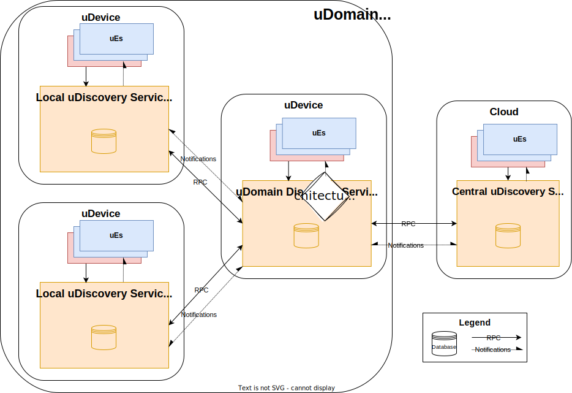
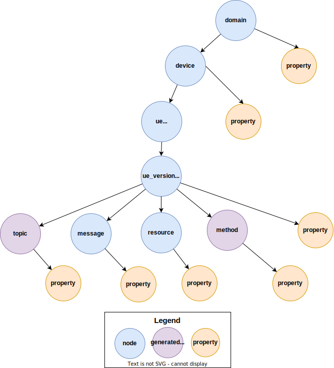
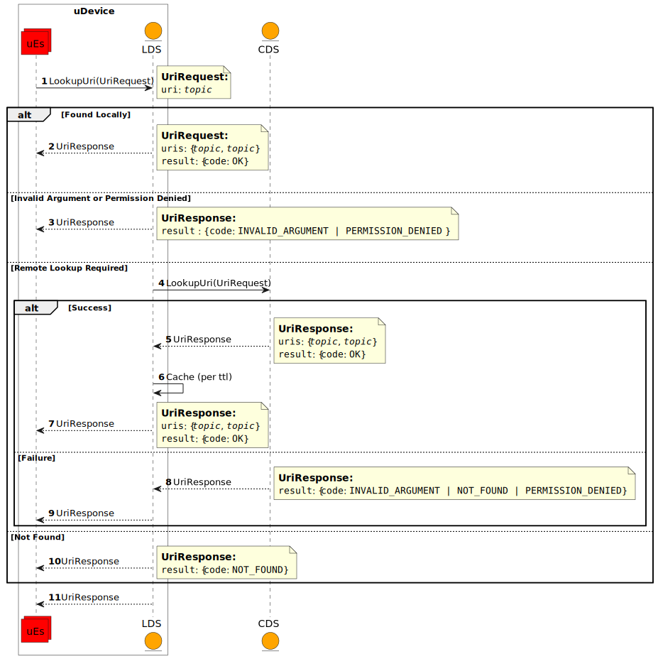
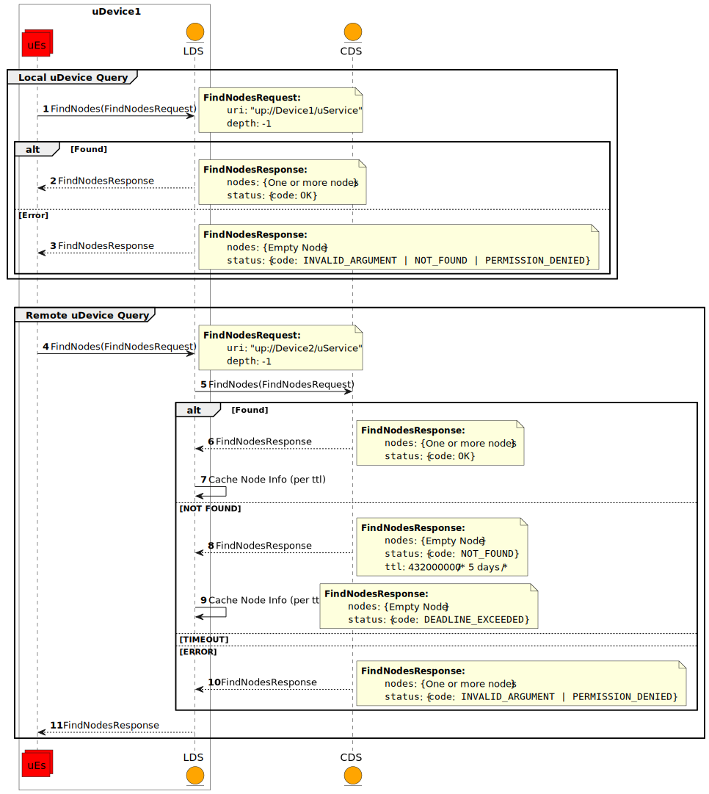

= uDiscovery
:toc:
:sectnums:

The key words "*MUST*", "*MUST NOT*", "*REQUIRED*", "*SHALL*", "*SHALL NOT*", "*SHOULD*", "*SHOULD NOT*", "*RECOMMENDED*", "*MAY*", and "*OPTIONAL*" in this document are to be interpreted as described in https://www.rfc-editor.org/info/bcp14[IETF BCP14 (RFC2119 & RFC8174)]

----
Licensed to the Apache Software Foundation (ASF) under one
or more contributor license agreements.  See the NOTICE file
distributed with this work for additional information
regarding copyright ownership.  The ASF licenses this file
to you under the Apache License, Version 2.0 (the
"License"); you may not use this file except in compliance
with the License.  You may obtain a copy of the License at

  http://www.apache.org/licenses/LICENSE-2.0

Unless required by applicable law or agreed to in writing,
software distributed under the License is distributed on an
"AS IS" BASIS, WITHOUT WARRANTIES OR CONDITIONS OF ANY
KIND, either express or implied.  See the License for the
specific language governing permissions and limitations
under the License.
----

== Purpose

uE's (Software Entities) will be deployed dynamically on devices that are scattered throughout the uProtocol network. In order for these dynamically deployed uE's to be able to know about what is available on their own device or on other devices, we need the ability to discover not only uEs but also what uEs serve (resources, methods, messages, etc...) as well as properties about devices. There exists today a number of Internet protocols such as DNS, Zeroconf, and others, to discover devices and of services running on said devices. the goal is to reuse as much as possible, existing Internet standards for discovering of uThings as well.

The purpose of this proposal is to define the discovery architecture so that uEs can dynamically discovery uThings (other uEs, uDevices, uDomains, uResources, uMethods, etc...), for example what topics a service in another device shall publish, properties of a service, etc...

== Background
=== Definitions of Terms
.Definition of Terms
[%autowidth]
[cols=",",options="header",]
|===
|Term |Definition
|DNS |Domain Name System covered in various IETF RFCs
|CDS |Central Discovery Service implementation of uDiscovery
|LDS |Local (to a device) implementation of uDiscovery
|Local Node |Node who is local to the device (local information)
|Remote Node |Node that is fetched from the CDS and cached in the LDS
|===

== Overview

uThing discovery is the process of a uEs looking up in a local database, information about either local or remote information. The database schema is defined using the structures Node and NodeProperty that are described in link:../../README.adoc[uProtocol] and declared in link:../../../../src/main/proto/core/udiscovery/v2/udiscovery.proto[udiscovery.proto]. Node is a representation of a uThing which NodeProperty could be any attributes of the Node (ex. version, permission, etc...). Figure below below illustrates the overall uThing discovery architecture.

.uProtocol Discovery Architecture

NOTE: Components described in <<udiscovery-ues>> below all implement link:../../../../src/main/proto/core/udiscovery/v2/udiscovery.proto[udiscovery.proto]

.uDiscovery Software Entities
[#udiscovery-ues]
[width="100%",cols="15%,35%,50%",options="header"]]
|===
|Component |Description |Requirements

|*Local uDiscovery Service (LDS)*
|Service to provide discovery of uThings per device. Every LDS has-a database that stores all of its local Nodes as well as caches node information for remote devices.
a|* Every uDevice *MUST* have LDS

| *Domain uDiscovery Service (uDDS)*
| Storage for discovery information for all devices within its domain
a|
* uDDS *MUST* store `Nodes` for all the devices under a given domain hierarchy
* *MUST* be only one uDDS within a domain
* A uLDS *MAY* be also function as uDDS and a uCDS for a uDomain or network
* uDDS *MUST* support queries from uLDSs that are within its domain
* uDDS *MUST* relay quires from uLDS to the uCDS and then cache the results per the TTL requirements from query API response
* uDDS *SHOULD* be located in the always-on uDevices

|*Central uDiscovery Service (CDS)*
|Central repository storing all deployed uDevice information in the network of connected devices residing in the Cloud. It is a superset of the local uDiscovery database content
a|
* *MUST* have one CDS that is globally addressable by the various domain/device LDS
|===

Function specific requirements shall be covered later in this document.

=== Hierarchical Specifications

The following section will elaborate on the uProtocol hierarchy elaborating how information is organized, referenced, and structured. This is the system classification specification used to identify and define "things" along with the storage of information (properties) of the uThings in the registry.

<> below introduces node and properties that we will define in this section. The diagram illustrates the hierarchy (taxonomy) for things in the network.

.Hierarchical Classification
[#img-hierarchical]

==== Node

Nodes are addressable uThings like device, service, topics, etc.... Each node has-a list of properties as well as 0-n child nodes. The declarations of nodes and properties can be found in the link:../../../../src/main/proto/core/udiscovery/v2/udiscovery.proto[udiscovery.proto], the snippet is below:

.Node & Property Definitions
[source]
----
// Typedef for a node properties. A node property can be any one of the types
// defined below
message PropertyValue {
  oneof attr {
    bool u_boolean = 1;       // Boolean
    int32 u_integer = 2;      // Integer
    string u_string = 3;      // String
    bytes u_bytes = 4;        // Raw Bytes
    string u_uri = 5;         // A URI
    google.protobuf.Timestamp u_timestamp = 6;  // Timestamp
  }
}

// Node can be domain, device, service, resource, method, etc...
message Node {
  // URI pointing to this node
  string uri = 1;

  // List of child nodes under this node
  repeated Node nodes = 2;

  // List of node properties
  map <string, PropertyValue>  properties = 3;

  // The node type
  Type type = 4;

  // What is the uThing (stored in Node) type. This is used to more easily
  // identify the Node rather than parsing from uri and inferring the type
  enum Type {
    INVALID = 0;    // Invalid node type
    DOMAIN = 1;     // uDomain
    DEVICE = 2;     // uDevice
    ENTITY = 3;     // uEntity (uE)
	VERSION = 9; 	// uE Version
    TOPIC = 4;      // uE Topic
    METHOD = 5;     // uE Method
    MESSAGE = 6;    // uE Message
	RESOURCE = 7;   // uE Resource
    USER = 8;       // User Information
  }
}
----

* The Node `uri` field *MUST* follow the URI specifications defined in uProtocol Specifications
** UE_VERSION *MUST* contain MAJOR
** UE_VERSION *MUST NOT* contain MINOR and PATCH

Table below lists example URIs for the various node types in the database hierarchy.

.Example URIs
[cols=",",options="header",]
|===
|Node Type |Example
|domain |up://UDOMAIN
|device |up://UDEVICE.UDOMAIN
|ue |up://UDEVICE.UDOMAIN/UE_NAME
|ue_version |up://UDEVICE.UDOMAIN/UE_NAME/UE_VERSION
|topic |up://UDEVICE.UDOMAIN/UE_NAME/UE_VERSION/RESOURCE#MESSAGE
|resource |up://UDEVICE.UDOMAIN/UE_NAME/UE_VERSION/RESOURCE
|message |up://UDEVICE.UDOMAIN/UE_NAME/UE_VERSION/#MESSAGE
|method |up://UDEVICE.UDOMAIN/UE_NAME/UE_VERSION/rpc.METHOD
|===

====  Markup Language

* YAML *SHALL* be used as the standard format for human-readable files (defining resources, services, properties, etc...)
* JSON *SHALL* be used as the runtime (machine-readable) markup language

==== Naming Conventions

* Identifiers nodes, and service names *SHALL* use lowercase a-z with underscore between words
* The service and resource names *SHALL* use lowercase a-z with underscore between words
* Interface (APIs) and event names *SHALL* use camel case notation starting with a capital letter. It is recommended to use only A-Z, a-z and 0-9 in node names
* Resources *SHALL* have a singular name (ex door, sunroof, etc.)

NOTE: Please see https://protobuf.dev/programming-guides/style/[Protobuf Style Guide] for more details

==== Properties

A property is a name-value pair of information associated with an uThing.

* Reserved property names (required for the protocol) *MUST* be added to link:../../../../src/main/proto/options.proto[options.proto]

Services can declare any non-reserved identifier in their own proto files.

NOTE: It is *STRONGLY RECOMMENDED* to scope your property names to avoid namespace collision

=== Database Access

The uDiscovery service, through the query and update APIs, allows any uE to discover or change the contents of the local and central databases. Given that we obviously do not want any uE to access anything in the database, we need to build in safety checks that are validated in both the local and central discovery service.

==== Policy

Table below outlines the database access policies written like network firewall rules (top to bottom). The rules will be broken down for specific rules for the LDS vs CDS.

===== All Components
* *MUST* block access by default

===== uLDS
* *MUST* allow local uE to read or write its own Node as well as its children Nodes
* *MUST* allow local uE to read Nodes that it has associated link:../../../up-l2/permissions.adoc[permissions] to do so
* Fetched Nodes *MUST* be cached per ttl requirements

===== uDDS
* *MUST* allow uLDS to read or write its own Node or its children Nodes
* Fetched Nodes *MUST* be cached per ttl requirements

===== uCDS
* *MUST* allow uDDS to read or write its own Node or its children Nodes

|3 | |
|4 | |*MUST* allow LDS to read additional uDevice Nodes that are within its scope Scoping (or grouping) of devices shall be defined in a later version of this specification

=== Node Metadata

Node metadata are stored outside the Node structure and describe the Node itself (freshness, etc...).

NOTE: How the metadata is stored in the database is implementation dependent, we will merely explain the metadata attributes and their purpose in this section

.Node Metadata Definition
|===
|Attribute |Type |RFC2119 |Description

|ttl |int32 |*REQUIRED* |Time-to-Live. How long (in milliseconds) the Node is valid for before it is outdated and needs to be refreshed. When the value is -1 the Node is considered to be valid forever. A Node is expired when the following is true:  \begin\{array}\{l}\displaystyle expired = t_\{current} > t_\{last_updated} + ttl\end\{array}
|last_updated |Timestamp |*REQUIRED* |Last time the content of the Node has changed (been written)
|last_accessed |Timestamp |*OPTIONAL* |The last time the Node was read (accessed) from a FindNodes() API call
|inactive |bool |*REQUIRED* |The Node has been tagged as inactive through the DeleteNode() API call
|===

API requirements related to Node metadata shall be covered in the subsequent section.

== Interface

In the following section we will explain the various APIs and interfaces that are defined in uDiscovery and their requirements. Interface definitions (input and output parameters, etc...) are covered in the link:../../../../src/main/proto/core/udiscovery/v2/udiscovery.proto[udiscovery.proto].

=== Notifications

Notifications are used for replicating information between uLDS, uDDS, and uCDS, and to notify local uEs if/when the content of the database has changed for various reasons such as:

* Installation of a new service version
* Change in property values
* Updates to device configurations
* etc...

In order for uEs to receive notifications, the uE calls the uDiscovery API `RegisterForNotifications()` passing `NotificationsRequest` message that includes the list of URIs that it would like to be notified of changes, and a value of how deep in the tree should the change notification be sent. When the depth field is set to -1 or not present, the notifications shall be sent for changes to all children nodes. Below are a few high level requirements for uDiscovery notifications:

* uE *MUST* be permitted to receive the notification (access the node). Permission is granted if the node is public or per [Appendix: Code-Based uE Access Permissions (CAPs)]
* Notifications *MUST* be sent on the topic `/core.udiscovery/2/nodes#Notification`

* uCDS *MUST* only allow notification registration from uDDS, and uDDS registration from uLDS

NOTE: uCDS or uDDS MAY allow local notification registration when it is also acting as a uLDS for the local device

* uLDS *MUST* only accept registration for Node Updates from local uEs or from the CDS and *MUST NOT* accept notification registration from other uDevices uEs

NOTE: Dynamic discovery of the CDS is out of scope at the time of writing of this specification and as such the CDS authority is known to the LDS. The CDS does not need to call `RegisterForNotifications()`, the LDS simply sends the notification event to the CDS.

==== Registration

When a uE wants to be notified of changes to Nodes for either local or remote devices, the uE calls RegisterForNotifications() passing the list of URIs of said nodes. Figure below illustrates the usage of the notification registration API.

.Registration for Notifications
image:notifications.svg[Notifications]

===  Read/Query APIs

Query APIs are used to lookup content in the database, either to resolve URIs (to be used by applications) or to fetch content of a database.

* Any uE *MAY* call the query APIs defined in the sections below
* *MUST NOT* return Nodes that are flagged as `inactive`
* Remote Nodes that have `expired` *MUST* be refreshed to the CDS
* Locally `expired` Nodes *MUST NOT* be returned in a query

==== URI Resolution: LookupUri()

Used by any uEs to find service instance location, and its current version. What is returned is a list of Uri strings of fully qualified uris. The lookup searches the node database to find instances that match the search criteria.

.Lookup URI

==== Find Node

Figure below illustrates the flows for performing a query to the LDS. An _empty node_, shown in the figure below, is a node with only the URI populated and is returned from LDS and CDS when the node is not found. The _empty node_ is used by the LDS to know that a node does not exist in the CDS and we do not need to keep querying the same node.

* *MUST* update `last_accessed` Node attribute when API is called

.Find Node

=== Write APIs

uDiscovery includes a set of APIs that allows uEs to change the content of the database. We will explain each APIs functions in the following section.

* *MUST* only allow uEs to update their own Node
* When `ttl` is not specified, *MUST* assume -1 (live forever)
* *MUST* verify caller has write permission to update, add, or delete a Node
* *MUST* verify caller has write permission the parent node when adding or deleting a Node
* *MUST* set the Node's `last_updated` to the current time when a write API is called

Additional CDS Requirements:

* LDS *SHALL* ONLY be permitted to update Node information for which the uDevice that the LDS runs on is in the list of ancestors of the Node.

==== Updating a Node

Below is the sequence when a change happens in the database
.Updating Nodes
image:update_nodes.svg["Update Nodes"]

==== Adding Node(s)

Below we shall give an example of a service called `uOTA` that will install a new service called `uService` to `Device1` illustrating how the `AddNodes()` API could be used. We will also show how the Update notification is sent to two observers; local uApp and the CDS (a remote observer).

.Add Nodes
image:add_nodes.svg[Add Nodes]

==== Deleting Node(s)

DeleteNode() API informs uDiscovery to tag a Node to be inactive. that the Node is no longer active Below shall provide an example of a service called `uOTA` that shall remove a service called `uService` from `Device1` illustrating how the `DeleteNode()` API can be used to remove a uE. We will also show how the Update notification is sent to two observers; a local uApp and the CDS (remote observer).

.Delete Node
image:delete_node.svg[Delete Node]

== Failure Recovery

In the event that the databases between the CDS and LDS becomes out of sync, the duscovery service components (uLDS, uDDS, uCDS) *MAY* fetch the contents using `FindNodes()` API.
