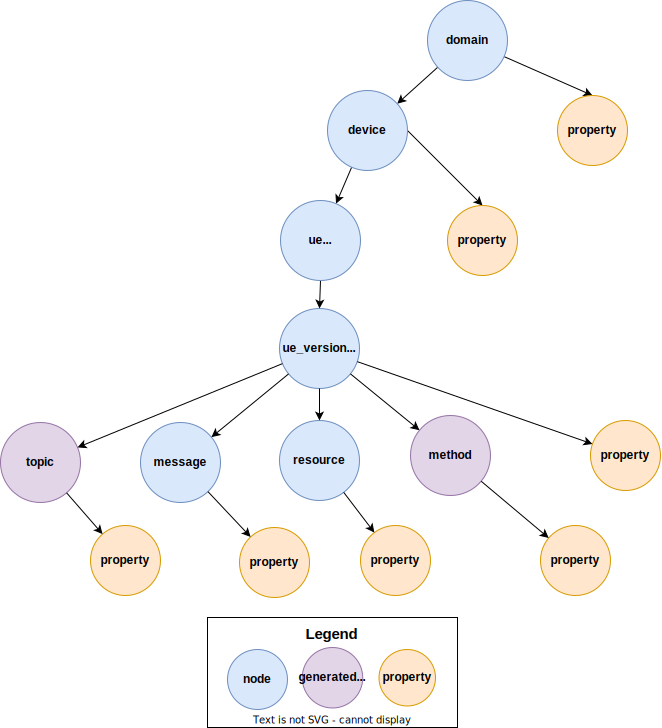

= uDiscovery
:toc:
:sectnums:
The key words "*MUST*", "*MUST NOT*", "*REQUIRED*", "*SHALL*", "*SHALL NOT*", "*SHOULD*", "*SHOULD NOT*", "*RECOMMENDED*", "*MAY*", and "*OPTIONAL*" in this document are to be interpreted as described in https://www.rfc-editor.org/info/bcp14[IETF BCP14 (RFC2119 & RFC8174)]

----
Copyright (c) 2023 General Motors GTO LLC

Licensed to the Apache Software Foundation (ASF) under one
or more contributor license agreements.  See the NOTICE file
distributed with this work for additional information
regarding copyright ownership.  The ASF licenses this file
to you under the Apache License, Version 2.0 (the
"License"); you may not use this file except in compliance
with the License.  You may obtain a copy of the License at

  http://www.apache.org/licenses/LICENSE-2.0

Unless required by applicable law or agreed to in writing,
software distributed under the License is distributed on an
"AS IS" BASIS, WITHOUT WARRANTIES OR CONDITIONS OF ANY
KIND, either express or implied.  See the License for the
specific language governing permissions and limitations
under the License.

SPDX-FileType: DOCUMENTATION
SPDX-FileCopyrightText: 2023 General Motors GTO LLC
SPDX-License-Identifier: Apache-2.0
----

== Purpose

Purpose of uDiscovery is to provide a functionality similar to DNS lookup. 

uE's (Software Entities) will be deployed dynamically on devices that are scattered throughout the uProtocol network. uDiscovery service provides functionality to discover uEs, their locations and what they serve (resources, methods, messages, etc...). 

== Background
=== Definitions of Terms
.Definition of Terms
[%autowidth]
[cols=",",options="header",]
|===
|Term |Definition
|DNS |Domain Name System covered in various IETF RFCs
|uCDS |Central Discovery Service implementation of uDiscovery
|uDDS | Domain Discovery Service(local to a domain) implementation of uDiscovery
|uLDS |Local (to a device) implementation of uDiscovery
|===

=== Hierarchical Specifications

The following section will elaborate on the uProtocol hierarchy elaborating how information is organized, referenced, and structured. This is the system classification specification used to identify and define "things" .

<> below introduces uEs and properties that we will define in this section. The diagram illustrates the hierarchy (taxonomy) for things in the network.

.Hierarchical Classification
[#img-hierarchical]

==== Node

Every ultifi entity that is addressable using URI is represented by a node message defined in link:../../../up-core-api/uprotocol/core/udiscovery/v3/udiscovery.proto[udiscovery.proto]. Each node has-a list of properties as well as 0-n child nodes. 

Table below lists example URIs for the various node types in the database hierarchy.

.Example URIs
[cols=",",options="header",]
|===
|Node Type |Example
|domain |up://UDOMAIN
|device |up://UDEVICE.UDOMAIN
|ue |up://UDEVICE.UDOMAIN/UE_NAME
|ue_version |up://UDEVICE.UDOMAIN/UE_NAME/UE_VERSION
|topic |up://UDEVICE.UDOMAIN/UE_NAME/UE_VERSION/RESOURCE#MESSAGE
|resource |up://UDEVICE.UDOMAIN/UE_NAME/UE_VERSION/RESOURCE
|message |up://UDEVICE.UDOMAIN/UE_NAME/UE_VERSION/#MESSAGE
|method |up://UDEVICE.UDOMAIN/UE_NAME/UE_VERSION/rpc.METHOD
|===

==== Naming Conventions

* Identifiers nodes, and service names *SHALL* use lowercase a-z with underscore between words
* The service and resource names *SHALL* use lowercase a-z with underscore between words
* Interface (APIs) and event names *SHALL* use camel case notation starting with a capital letter. It is recommended to use only A-Z, a-z and 0-9 in node names
* Resources *SHALL* have a singular name (ex door, sunroof, etc.)

NOTE: Please see https://protobuf.dev/programming-guides/style/[Protobuf Style Guide] for more details

==== Properties

A property is a name-value pair of information that is declared using Protobuf Options. There are two types of properties:

1. *uProtocol Properties:* Required properties that all services must set, these are defined https://github.com/eclipse-uprotocol/up-core-api/blob/main/uprotocol/uprotocol_options.proto[uprotocol-options.proto]
2. *uService Specific Properties:* Properties that are declared in their respective service proto. 

Services can declare any non-reserved identifier in their own proto files.

NOTE: It is *STRONGLY RECOMMENDED* to scope your property names to avoid namespace collision

== uDiscovery Interface

In the following section we will explain the various APIs and interfaces that are defined in uDiscovery and their requirements. Interface definitions (input and output parameters, etc...) are covered in the link:../../../up-core-api/uprotocol/core/udiscovery/v3/udiscovery.proto[udiscovery.proto].

=== Write APIs 
Write APIs are used to populate/ update data in 'local' discovery instance. 

==== Set UE Topics
This API shall be used by ultifi entities to update discovery with the list of topics they serve. This includes the topics they publish on and also the rpcs they serve. 

==== Set UE Properties
This is used by ultifi entities if there is a need to update any of their properties in discovery. For example, version updates. 

===  Read/Query APIs

Query APIs are used to lookup content in the database, either to resolve URIs (to be used by applications) or to fetch content of a database.

* Any uE *MAY* call the query APIs defined in the sections below
* Remote Nodes that are `expired` *MUST* be refreshed to the CDS
* Locally `expired` Nodes *MUST NOT* be returned in a query

==== Find UE

Find UE is used by conusmers to find service instances. uDiscovery shall lookup UE details locally first and try to get it from remote instances if not found locally. 

Figure below illustrates the flows for performing a query to the LDS. Uri details for requested uE are returned if found in uLDS first, else the query is sent to uDDS and in turn to uCDS if required.

==== Get UE Topics
Get uE Topics is used to fetch the list of topics published by a uE. Data available locally and in cache for remote uEs shall be returned in response of this API.

==== Get UE List
Get UE list is used retrieve the list of UEs for a given device. 

==== Get Device List
Get device list is similar to Get UE list, but at a domain level. Consumers would use this API to retrieve all devices under a given domain.

=== Replication/ Synchronization APIs

==== Sync Data

This is used by local discovery instances to push local updates to domain and from domain to central. 

== Failure Recovery

In the event that the databases between the CDS and LDS becomes out of sync, the discovery service components (uLDS, uDDS, uCDS) *MAY* fetch the contents using read APIs.
