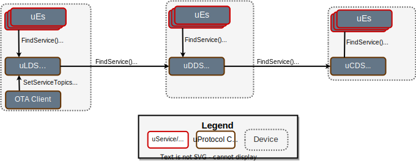

= uDiscovery Service
:toc: preamble
:sectnums:
:source-highlighter: highlight.js
:client-proto-ref: link:../../../up-core-api/uprotocol/core/udiscovery/v3/udiscovery.proto[udiscovery.proto]
:replicator-proto-ref: link:../../../up-core-api/uprotocol/core/udiscovery/v3/udiscovery.proto[udiscovery_replicator.proto]


The key words "*MUST*", "*MUST NOT*", "*REQUIRED*", "*SHALL*", "*SHALL NOT*", "*SHOULD*", "*SHOULD NOT*", "*RECOMMENDED*", "*MAY*", and "*OPTIONAL*" in this document are to be interpreted as described in https://www.rfc-editor.org/info/bcp14[IETF BCP14 (RFC2119 & RFC8174)]

----
SPDX-FileCopyrightText: 2024 Contributors to the Eclipse Foundation

See the NOTICE file(s) distributed with this work for additional
information regarding copyright ownership.

This program and the accompanying materials are made available under
the terms of the Apache License Version 2.0 which is available at
https://www.apache.org/licenses/LICENSE-2.0
 
SPDX-FileType: DOCUMENTATION
SPDX-License-Identifier: Apache-2.0
----

== Overview

UDiscovery provides the means for uEntities (might be abbreviated as *uE*, especially in diagrams) to discover local and remote service instances and their metadata. The uDiscovery design takes inspiration from Domain Name System (DNS) principles in that uDiscovery instances are also organized in a tree structure and information is replicated and cached along the branches of the tree. Each uDiscovery instance first tries to respond to queries from its local data but can also delegate the query to its parent node if requested by the client. In a typical deployment, the tree has (at least) three levels. Each device in a vehicle has its own uDiscovery service instance. These represent the leaf nodes of the tree. Each vehicle also has a _domain_ level uDiscovery service instance. These form the middle-level nodes of the tree. Finally, a central uDiscovery service instance, usually running in a back end, sits at the root of the tree.

UDiscovery Service implements two sets of APIs:

- *Client APIs ({client-proto-ref}):* Used by uEntities to find services and their topic metadata.

- *Replication API ({replicator-proto-ref}):* Used internally by uDiscovery service instances to add, update, or delete service metadata along the branches of the uDiscovery tree.

<<udiscovery-design>> below provides an overview of the design and use of the Client and Replication APIs to implement the uDiscovery business logic.

.uProtocol Discovery Design
[#udiscovery-design]


=== Terms

- *Fully Qualified Service URI (FQURI):* A URI that contains all the information needed to uniquely identify a service. A fully qualified service URI contains the following information:
  - *authority_name:* The name of the authority that hosts the service.
  - *ue_id:* The unique identifier of the service (both the _instance_ and _service ID_ parts).
  - *ue_version_major:* The version of the service.
  - *resource_id:* The resource ID (value of 0 is used to indicate the default ID for the service).


== uDiscovery APIs

In the following section we will elaborate on the requirements for implementing the server-side of {client-proto-ref}.

=== FindServices()

A client uEntity invokes `FindServices()` to get meta data (authority, version, instance ID) of (deployed) service instances of a given type.```

[.specitem,oft-sid="dsn~discovery-findservices-error-invalid~1",oft-needs="impl,test"]
--
* *MUST* return `UCode.INVALID_ARGUMENT` if the passed in URI is not a valid xref:../../../basics/uri.adoc[uProtocol URI].
--

[.specitem,oft-sid="dsn~discovery-findservices-error-notfound~1",oft-needs="impl,test"]
--
* *MUST* return `UCode.NOT_FOUND` if no service matching the URI was found.
--

[.specitem,oft-sid="dsn~discovery-findservices-error-permission~1",oft-needs="impl,test"]
--
* *MUST* return `UCode.PERMISSION_DENIED` if the caller is not permitted to invoke this API.
--


=== GetServiceTopics()

`GetServiceTopics()` is used to fetch metadata about one or more topics based on the passed `UUri`. Clients call this API to get additional information about the topic(s) such as the message format, id, permission level, etc.

[.specitem,oft-sid="dsn~discovery-getservicetopics-error-invalid~1",oft-needs="impl,test"]
--
* *MUST* return `UCode.INVALID_ARGUMENT` if the passed in URI is not a valid xref:../../../basics/uri.adoc[uProtocol URI].
--

[.specitem,oft-sid="dsn~discovery-getservicetopics-error-notfound~1",oft-needs="impl,test"]
--
* *MUST* return `UCode.NOT_FOUND` if no topic matching the URI was found.
--

[.specitem,oft-sid="dsn~discovery-getservicetopics-error-permission~1",oft-needs="impl,test"]
--
* *MUST* return `UCode.PERMISSION_DENIED` if the caller is not permitted to invoke this API.
--


=== Recursive Lookups

Recursive lookups happen when the client sets the following information in the request message of the FindService() or GetServiceTopics() API:
[.specitem,oft-sid="dsn~discovery-recursive-authority-wildcard~1",oft-needs="impl,test"]
--
*  `authority_name` *MUST* contain the wildcard `*`.
--

If the `recursive` flag of a `FindServicesRequest` or `GetServiceTopicsRequest` is set to `true`:
[.specitem,oft-sid="dsn~discovery-recursive-central~1",oft-needs="impl,test"]
--
* *MUST* search recursively along the branch within the uDiscovery service instance hierarchy up to and including the root node of the tree.
--

UDiscovery services perform a recursive search when the local or domain instance calls `FindService()` or `GetServiceTopics()` API and then propagates the response back to the client.

[.specitem,oft-sid="dsn~discovery-recursive-async~1",oft-needs="impl,test"]
--
* The original local search *MUST ONLY* return the response message when the recursive search has completed. The link:../../../up-core-api/uprotocol/v1/uattributes.proto[`UAttribute.ttl`] is passed to the method invocation to indicate when the lookup should timeout.
--

[.specitem,oft-sid="dsn~discovery-recursive-internal~1",oft-needs="impl,test"]
--
* A uDiscovery service instance *MUST NOT* cache the result of a recursive search for longer than the duration indicated in the `ttl` attribute from the parent uDiscovery instance's response message.
--


.Recursive Search to Central
[#recursive-search-central]
[mermaid]
ifdef::env-github[[source,mermaid]]
----
sequenceDiagram

Client ->> Local-UDiscovery: FindService()
Local-UDiscovery ->> Domain-UDiscovery: FindService()
Domain-UDiscovery ->> Central-UDiscovery: FindService()
Central-UDiscovery -->> Domain-UDiscovery: FindServicesResponse
Domain-UDiscovery -->> Local-UDiscovery: FindServicesResponse
Local-UDiscovery -->> Client: FindServicesResponse
----


== Replication API


=== SetServiceTopics()
The `SetServiceTopics()` API is used by uDiscovery service instances to add, update or remove information along branches in the uDiscovery instance tree. The `SetServiceTopicsRequest` message contains a list of `UServiceTopicInfo` and corresponding `ttl` for when the info will expire. The `SetServiceTopicsResponse` message indicates the outcome of the operation. 


* link:../languages.adoc[uProtocol Language Libraries] *MUST NOT* implement the client-side of {replicator-proto-ref} API as these APIs are only used internally by uDiscovery business logic.

To replicate new or updated `UServiceTopic` metadata:
[.specitem,oft-sid="dsn~discovery-setservicetopic-update~1",oft-needs="impl,test"]
--
* `ttl` value in `SetServiceTopicsRequest` *MUST* be set to the duration the metadata is valid for or absent from the message to indicate the metadata is valid forever.
--

To replicate removal of `UServiceTopic` metadata:
[.specitem,oft-sid="dsn~discovery-setservicetopic-remove~1",oft-needs="impl,test"]
--
* `ttl` value in `SetServiceTopicsRequest` *MUST* be set to 0.
--

`SetServiceTopics()` Failure Reasons:

[.specitem,oft-sid="dsn~discovery-setservicetopic-error-invalid~1",oft-needs="impl,test"]
--
*MUST* return `UCode.INVALID_ARGUMENT` if the passed in URI is not a valid xref:../../../basics/uri.adoc[uProtocol URI].
--
  
[.specitem,oft-sid="dsn~discovery-setservicetopic-error-permission~1",oft-needs="impl,test"]
--
* *MUST* return `UCode.PERMISSION_DENIED` if the caller is not uDiscovery service in the correct recursive order (i.e. local -> domain -> central).
* *MAY* grant access to deployment specific uEntities such as a the software manager that installs or removes uEntities.
--

[.specitem,oft-sid="dsn~discovery-setservicetopic-error-notfound~1",oft-needs="impl,test"]
--
* *MUST* return `UCode.NOT_FOUND` if no topic matching the URI was found when the `UServiceTopic` is being removed (i.e. `ttl=0`).
--

<<udiscovery-replication-design>> below illustrates how data is replicated using a trusted OTA (_over-the-air_) uEntity that is responsible for installing or removing applications for said device. 

.Replication API Design
[#udiscovery-replication-design]
[mermaid]
ifdef::env-github[[source,mermaid]]
----
sequenceDiagram

OTAClient ->> Local-UDiscovery: SetServiceTopics()
Local-UDiscovery -->> OTAClient: SetServiceTopicsResponse

Local-UDiscovery ->> Domain-UDiscovery: SetServiceTopics()
Domain-UDiscovery -->> Local-UDiscovery: SetServiceTopicsResponse

Domain-UDiscovery ->> Central-UDiscovery: SetServiceTopics()
Central-UDiscovery -->> Domain-UDiscovery: SetServiceTopicsResponse
----


== Implementation Consideration

It is possible the information in domain or central instances might become out of sync with what is stored in the other instances. In order to rectify this situation:

[.specitem,oft-sid="dsn~discovery-data-reconciliation-child~1",oft-needs="impl,test"]
--
* Child nodes *MUST* re-sync with their parent node when there is a change (ex. reset, add/remove of information, etc...), this ensures reconciliation only happens in one direction, from the child to the parent.
--

[.specitem,oft-sid="dsn~discovery-data-reconciliation-frequency~1",oft-needs="impl,test"]
--
* Domain and central instances *MUST* provide an implementation of data reconciliation using the above APIs where the frequency of reconciliation is customizable so the deployment can adjust the frequency based on the deployment needs.
--

[.specitem,oft-sid="dsn~discovery-data-reconciliation-data~1",oft-needs="impl,test"]
--
* When reconciling data, a client *MUST* replace corresponding data in its local cache with the fetched data. 
--

[.specitem,oft-sid="dsn~discovery-data-reconciliation-not-found~1",oft-needs="impl,test"]
--
* Cached data *MUST* be flush if `GetServiceTopics()` returns `UCode.NOT_FOUND`, this indicates the information is no longer present upstream. 
If the reconciliation fails, the service *MUST* log the error and continue to use the current cached data.
--

<<udiscovery-reconciliation>> below provides an example of the domain instance reconciling with local instance and then propagating the change to the central instance. In the example the reconciliation (determining if the data is out of sync or not) happens in the `ReconcileData()` function.

.Reconciliation Example
[#udiscovery-reconciliation]
[mermaid]
ifdef::env-github[[source,mermaid]]
----
sequenceDiagram

participant Local-UDiscovery
participant Domain-UDiscovery
participant Central-UDiscovery

Domain-UDiscovery ->> Local-UDiscovery: GetServiceTopics()
Local-UDiscovery -->> Domain-UDiscovery: GetServiceTopicsResponse
Domain-UDiscovery ->> Domain-UDiscovery: ReconcileData()

Domain-UDiscovery ->> Central-UDiscovery: SetServiceTopics()
Central-UDiscovery -->> Domain-UDiscovery: SetServiceTopicsResponse
----


