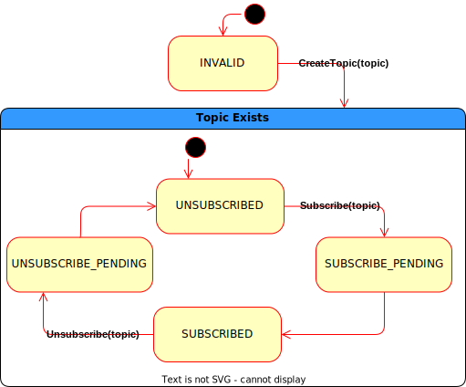
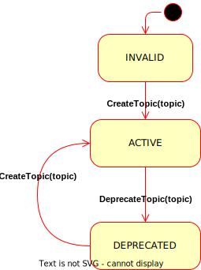
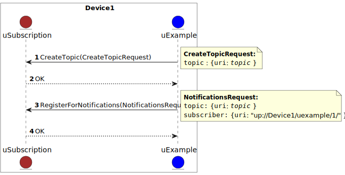
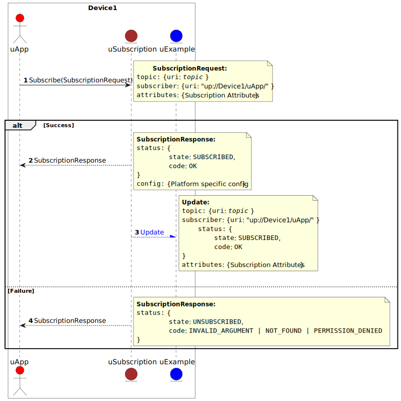
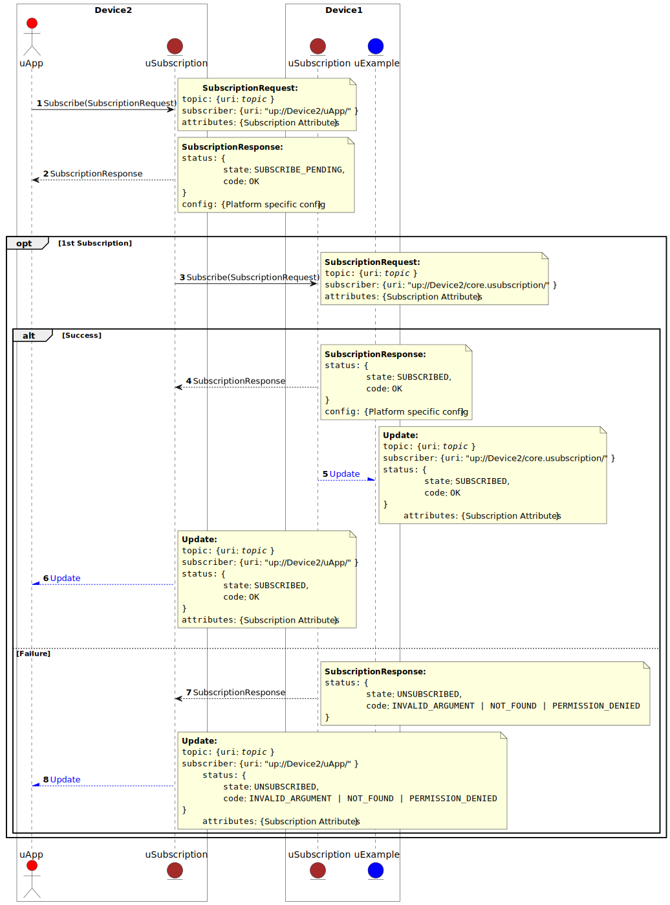
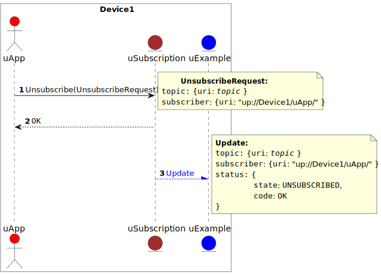
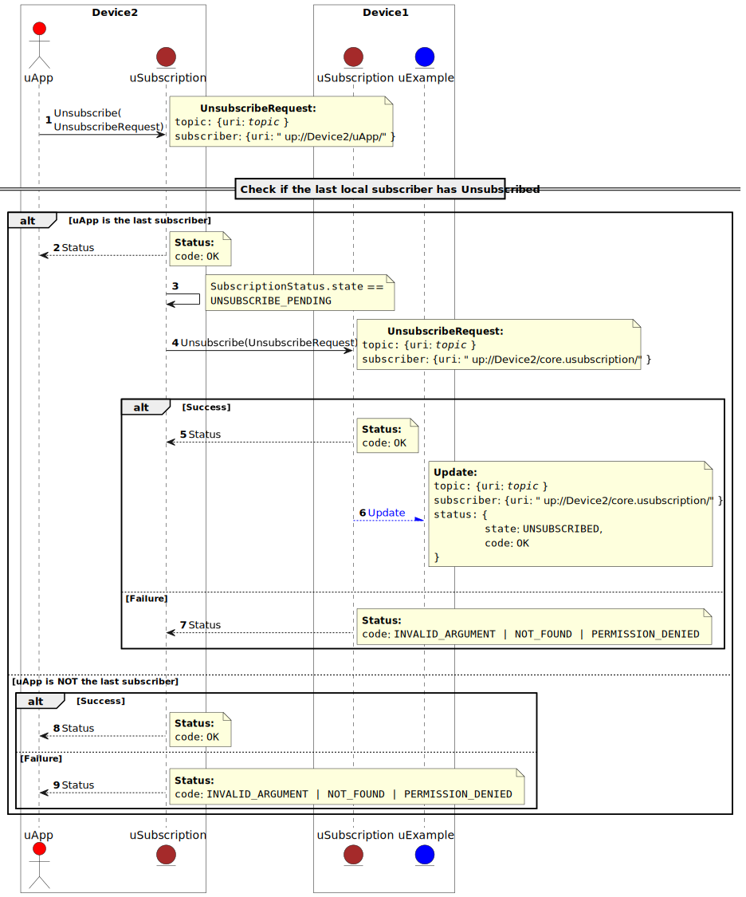
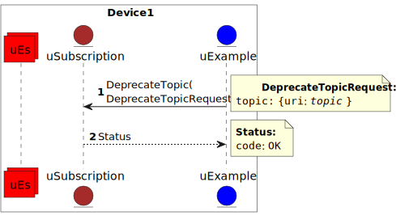

= uSubscription
:toc:
:sectnums:

The key words "*MUST*", "*MUST NOT*", "*REQUIRED*", "*SHALL*", "*SHALL NOT*", "*SHOULD*", "*SHOULD NOT*", "*RECOMMENDED*", "*MAY*", and "*OPTIONAL*" in this document are to be interpreted as described in https://www.rfc-editor.org/info/bcp14[IETF BCP14 (RFC2119 & RFC8174)]

----
Copyright (c) 2023 General Motors GTO LLC

Licensed to the Apache Software Foundation (ASF) under one
or more contributor license agreements.  See the NOTICE file
distributed with this work for additional information
regarding copyright ownership.  The ASF licenses this file
to you under the Apache License, Version 2.0 (the
"License"); you may not use this file except in compliance
with the License.  You may obtain a copy of the License at

  http://www.apache.org/licenses/LICENSE-2.0

Unless required by applicable law or agreed to in writing,
software distributed under the License is distributed on an
"AS IS" BASIS, WITHOUT WARRANTIES OR CONDITIONS OF ANY
KIND, either express or implied.  See the License for the
specific language governing permissions and limitations
under the License.

SPDX-FileType: DOCUMENTATION
SPDX-FileCopyrightText: 2023 General Motors GTO LLC
SPDX-License-Identifier: Apache-2.0
----

Publisher & Subscribers Architecture Pattern allows subscribers to subscribe to topics published by publisher that can be running on the same device and/or different devices (that might not even maintain a persistent connection to each other).

Off the shelf broker and broker-less solutions, rely on specific Internet protocols that do not scale for automotive use cases nor do they support producers and consumers that talk different pub/sub protocols (ex. MQTT, DDS, SOME/IP, proprietary, etc...).

uSubscriptions purpose is to explain _how_ the distributed publisher-subscriber architecture pattern can be implemented through a ubiquitous language and communication protocol across the distributed devices. We will define the interfaces, sequences, and state machines to be able to support the use cases mentioned above.

NOTE: uSubscription interface is defined https://github.com/eclipse-uprotocol/up-core-api/blob/main/uprotocol/core/usubscription/v3/usubscription.proto[usubscription.proto] and follows link:../../basics/README.adoc#_error_model[uProtocol Error Model] for return codes. Please refer to link:../../../../README.md[README] for how to build the proto (and stubs) for the various languages

== Topics

A topic describes what the calling applications (subscribers) wants to subscribe too. Topic are expressed in link:../../basics/README.adoc#_uprotocol_uri[uProtocol URIs] format. Topics used in uSubscription APIs have the additional requirements of:

* *MUST* contain `UE_NAME`, `UE_VERSION`, `RESOURCE`, and `MESSAGE`
* `UE_VERSION` *MUST* contain the `MAJOR`, *MUST NOT* contain the `MINOR` or `PATCH`

NOTE: Only the `MAJOR` is used in topics to support backwards compatibility between minor version updates of uEs to avoid the need to re-subscribe to topics when the uE `MAJOR` was not updated.  Subscribers *MUST* re-subscribe to topics when the uE `MAJOR` version has changed

Example: `up:/body.access/1/door.front_left#Door`

== Subscription States

In the following section we will elaborate on the states that a subscription can transition in and out from based on the various APIs called by producers and consumers. 

NOTE: `SUBSCRIBE_PENDING` and `UNSUBSCRIBE_PENDING` states only apply to remote topic subscriptions, more details shall be provided below.

.Subscription State Machine
[width="100%",cols="17%,20%,19%,26%,18%",options="header",]
|===
|State |Description |Entry |Do |Exit

|`*INVALID*`
|Topic does not exist because the producer has not called CreateTopic() yet.
|Initialization
a|* Active subscriptions are removed
* Notify any observers when subscription has changed
|CreateTopic() called by producer

| `*UNSUBSCRIBED*`
|Subscriber uE is not subscribed but the topic exists
a|* Topic created
* Subscriber unsubscribed
|
|Subscribe() is called by a consumer

| `*SUBSCRIBED*`
|Subscriber uE is subscribed to the topic
|Subscription request has been processed and accepted
|
|* Subscriber has called Unsubscribe()

|`*SUBSCRIBE_PENDING*`
|Subscription is pending acknowledgement from the remote SubscriptionService
|1st Subscriber uE has called Subscribe() to a remote topic
|Forwards the subscription request to the destination device's SubscriptionService
|Received a response from the remote SubscriptionService

| `*UNSUBSCRIBE_PENDING*`
|Unsubscribe is pending processing by the producers remote uBus
|Last subscriber called Unsubscribe()
a|* Send an unsubscribe request to the remote uBus
* return https://github.com/googleapis/googleapis/blob/master/google/rpc/status.proto[google.rpc.Status] with:
** https://github.com/googleapis/googleapis/blob/master/google/rpc/code.proto[google.rpc.Code]: OK
** SubscriptionStatus
|
|===

.Subscription State Machine

=== Topic Lifecycle

.Topic State Machine
[width="100%",cols="24%,76%",options="header",]
|===
|State |Description

|`*INVALID*` |Topic does not exist because the producer has not called CreateTopic() yet
|`*ACTIVE*` |Producer has called CreateTopic() and uSubscription can accept subscriptions to said topic
|`*DEPRECATED*` a|
Producer has tagged the topic as deprecated so uSubscription

* Subscription requests to deprecated topics *MUST* return `FAILED_PRECONDITION`

|===

NOTE: uSubscription will persist the known topic state (`ACTIVE`, or `DEPRECATED`)

.Topic State Machine

Changing the topic state happens through the APIs CreateTopic() and DeprecateTopic(). Below are the requirements for the different topic related APIs:

* *MUST* be a valid topic URI (containing UE_NAME, UE_VERSION, RESOURCE, and MESSAGE)
* *MUST* verify that only the producer of a topic can call `CreateTopic()` or `DeprecateTopic()`. Verification is done by ensuring the uE name and version inside the `SubscriberInfo` and topic URIs match

== Subscription Change Notifications

The uSubscription service notifies observers when there is a change in a subscription states by publishing notification events to the topic `up:/core.usubscription/2/subscriptions#Update`.  Below are the specific nuances about the subscription change notification based on the observer type.

===  Subscribers

Subscribers are automatically registered to receive subscription change notifications for topics they have subscribed too through the Subscribe() API.

* Subscribers *MUST NOT* call the `RegisterForNotifications(`) as they are not permitted to receive notifications for subscription changes by other subscribers
* Subscription change notification *MUST* be sent whenever the `SubscriptionState` changes for said subscriber (ex, `SUBSCRIBE_PENDING` → `SUBSCRIBED`)

=== Publishers

* *MUST* *NOT* be permitted to call `RegisterForNotifications()` for topics they do not create through the  `CreateTopic()`, only the topics they produce
* Subscription change notifications *MUST* be sent for changes to `SubscriptionState` for any subscriber that is subscribed to the topic

=== Dispatchers

Dispatchers are also permitted to register for subscription change notifications to facilitate the multicasting of events. The mechanics and requirements of the dispatcher and uSubscription communication are platform deployment specific. 

== Event Delivery

uSubscription service, in addition to managing subscriptions for subscribers to topics, also plays a key role in providing event delivery configuration details as not every platform delivers events using the same mechanism. 

the `EventDeliveryConfig` message is one of the fields returned to the subscriber to provide details of how to consume the data (how events are delivered). For example if the subscriber has to consume from a different topic or from different event infrastructure, this message will store those delivery semantics.

NOTE: Delivery semantics (if any) are deployment specific and not covered in this specification

== uSubscription Sequences

In the following section, we will elaborate on the various subscription flows for local and remote topics. When a consumer subscribes to a remote topic, it is the responsibility of the Subscription Service to relay the subscription request to the remote Subscription Service as can be illustrated in the sequence diagrams below.

For the flows below we will use a fictitious device called Device1 hosting a service called uExample that has a resource that emits a Message.

NOTE: Throughout this section we will use the sample topic `up://Device1/uexample/1/resource#Event` to illustrate the various sequences. The above-mentioned topic will be replaced with `_topic_` in the diagrams

uSubscription exposes APIs to broker communication between subscribers and producers. The service shall implement two design patterns that shall be described in the table below.

.uSubscription Design Pattern Use Cases
[width="100%",cols="76%,24%",options="header",]
|===
|Purpose |Pattern

|* uEs (subscribers and producers) to invoke uSubscription APIs service to perform operations such as `Subscribe()`, `Unsubscribe()`, `CreateTopic()` etc...
* For uSubscription to communicate with other uSubscription services running on other devices when subscribing to remote topics
|*RPC*

|* Informing subscribers of changes to their subscription. This allows subscribers to react if/when a subscription is not successful at a remote device or when a topic is no longer being served by the producer
* Informing registered observers of added or removed subscribers

|*Notification*
|===

=== Topic Creation

Topic creations, also known as the setup phase, is the first step in the subscription process and performed by the producer to notify uSubscription that it will produce to a given topic. 

.Setup Flow

=== Subscription

Subscription flow will show how a subscriber can subscribe to the example topic when uApp is on the same device (local subscriptions) or remote device (remote subscriptions).

==== Within a uDevice

.Local Subscription Flow

==== Between uDevices

.Remote Subscription Flow

* uSubscription *MUST* change the subscriber to itself (core.usubscription) when subscribing to remote topics, this allows the reverse flow (publication) to be properly multicasted to local subscribers by the uBus when it queries the local uSubscription for a list of local subscribers 

=== Unsubscribe

==== Within a uDevice

.Local Unsubscribe Flow

==== Between uDevices

.Remote Unsubscribe Flow

* uSubscription *MUST* change the subscriber to itself (core.usubscription) when unsubscribing to remote topics 

=== Topic Deprecation

This API is used to tag a topic as deprecated. Deprecated topics can no longer be subscribed to by subscribers. The following are the uSubscription API requirements:

* *MUST* be changed the topic state to DEPRECATED
* *MUST* no longer allow subscribers to Subscribe() to said topic
* *MUST* not change the SubscriptionState for existing subscribers  (i.e. no subscription change notification is sent)

==== Within a uDevice

.Local Topic Deprecation Flow

==== Between uDevices

NOTE: Dissemination of the state of deprecated topics to remote uSubscription services that has subscribers to the topic is not covered in this version of the specification.

== Timeout & Retry Logic

Subscribe (and unsubscribe) to remote topics are handled by RPC calls between uSubscription services running on the different devices. Given that devices are not always connected to each other, the onus is on uSubscription service to ensure that a command is received in time. to ensure consistency between implementations of uSubscription, we will explain the retry and timeout policies for remote command invocations in the sequence flows below. command is on the uSubscription service.   

* Remote requests *MUST* have a maximum timeout of 5 minutes
* All timed-out remote commands *MUST* be retied indefinitely until the business logic behind it no longer requires the command to be sent.  +
Example: Remote Subscribe() request will be retied until the subscriber no longer wishes to be subscribed (they call the Unsubscribe() API) 
* Remote commands *MUST* be retried upon device to device connectivity (link up) and *MUST NOT* be tried when there is no device connectivity (link down)
