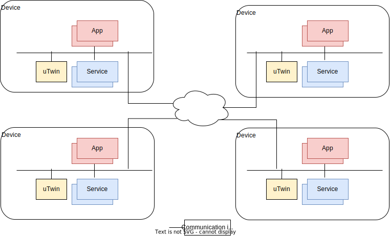
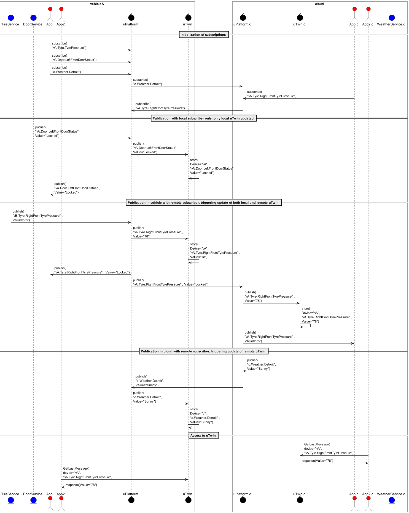

= Digital Twin (uTwin)
%toc%
:sectnums:

The key words "*MUST*", "*MUST NOT*", "*REQUIRED*", "*SHALL*", "*SHALL NOT*", "*SHOULD*", "*SHOULD NOT*", "*RECOMMENDED*", "*MAY*", and "*OPTIONAL*" in this document are to be interpreted as described in https://www.rfc-editor.org/info/bcp14[IETF BCP14 (RFC2119 & RFC8174)]

----
SPDX-FileCopyrightText: 2023 Contributors to the Eclipse Foundation

See the NOTICE file(s) distributed with this work for additional
information regarding copyright ownership.

This program and the accompanying materials are made available under
the terms of the Apache License Version 2.0 which is available at
https://www.apache.org/licenses/LICENSE-2.0
 
SPDX-FileType: DOCUMENTATION
SPDX-License-Identifier: Apache-2.0
----

== Purpose

In uProtocol, uEs rely on other uEs that expose services, named uServices. These uServices publish information, named events, on Topics, through the implementations of uProtocol. These events can be considered to represent updates to the uService _state._ The collection of last published event of each Topic of a uService therefore represents the current "public state" of the uService (public because some more internal states might exist without being exposed externally).

An event published on a uDevice is propagated to all other uDevices that have at least one uE subscribed to the corresponding Topic, but only to those devices, These events can therefore be stored on the received devices "for free", i.e. without requiring a dedicated transmission. Storing the last event received per-topic, on each uDevice, therefore enables access without re-transmission overhead/cost/latency for uEs running on the same device devices that wish to retrieve the last state of a uService, i.e. the last event published on a Topic. Implementing such storage mechanism essentially implements a digital twin mechanism for uEs in the sense that uE's last known states are stored in all uDevice that are subscribed to the uService, and accessible by local uE. <<utwin-overview>> figure below provides a visual description of the context.

.uTwin
[#utwin-overview]

A uE requiring information/state from a uService will therefore subscribe to Topics of interest created by that uService. Consequently, once a uE is _connected_ *and* _subscribed to uServices it requires_, it will receive any state update (of interest, i.e. to which it subscribed). The unresolved issue is to define a mechanism that enables a uE to receive the "last known state" (published while the uE was not connected) of the uServices it relies on. A uE _connects_ for the following reasons:

* Executed for the first time after installation
* Connected to a new uService (e.g. cloud uE connecting to a new vehicle that enrolled to the service provided by the cloud uE)
* uE restarting for whatever reason (uE crash, ignition off, system in deep sleep)

The mechanism aimed at providing "last known uService state" to uEs requiring it is also known as digital twin. While  this mechanism is usually used for replication of a state in remote devices (e.g. IoT device state replicated in Cloud), in our context, we also need a similar mechanism to deliver such last known state to local uEs. <<last-known-state-use-cases>> below illustrates the usefulness of the uTwin:

.Example Last-Known-State Use Cases
[width="100%",cols="30%,25%,24%,21%",options="header",]
[#last-known-state-use-cases]
|===
|*from \ to* |*Vehicle* |*Mobile* |*Cloud*
|*Vehicle* |Yes |Yes |Yes
|*Mobile* |Yes |No |Yes
|*Cloud* |Yes |Yes |No
|===

Main justification for the need of digital twin are described below:

* **Device-to-device Twin: **
  ** To enable remote Apps to access last published state (and received by the device)
  ** To remain accessible even if connectivity is lost
* **In-vehicle Twin: **
  ** To avoid re-sending (re-publishing) data when apps are launched/subscribed

This document suggests approaches to implement a digital twin concept for uProtocol.

NOTE: The uTwin interface is link:../../../up-core-api/uprotocol/core/utwin/v2/utwin.proto[utwin.proto]

== Proposal

The solution consists in creating a software component, named uTwin, that embodies this automatically created and updated digital twin component. The uTwin component is connected to the communication framework (i.e. the uBus) of each device in charge of dispatching messages.

* Every publish message that flows through the uBus *SHALL* be “delivered” to uTwin

the uTwin stores the published message using a _primary key_ to enable local software components to retrieve it. This _primary key_ is the full name of the Topic, hence also including the device name. The fact that the _primary key_ represents a topics ensures that only the last event of a given Topic is stored in the uTwin. The collection of events stored in a uTwin instance of a device, whose keys include a specific device name (e.g. deviceA), represent the digital twin of that device (deviceA in our example).

Examples of events for a vehicle may include tire pressure, window position, gear position but also vehicle mode (driving, parked), and in general any information that is published within the vehicle for the purpose of operating it and activating its features.

So, for example, if a cloud application MyApp subscribes to the tire pressure of a given vehicle (named vehA), then every time vehA publishes a new value for the tire pressure, the event will be delivered to the cloud and to MyApp. The uTwin instance running on the cloud will also receive this information and store it with the primary key including the vehicle name vehA and the topic name TirePressure, so that any other software subsequently wishing to access the tire pressure can simply request it from the cloud uTwin.

<<utwin-sequence-diagram>> below illustrates the overall mechanism, with special focus on the following properties:

* Implicit (automatically inferred) digital twin model: no need for manual definition of the dig twin model
* Dynamic model creation, based on events that flow through the distributed communication framework  (named uProtocol Implementation in the diagram) and storage of device states (represented by the collection of service topics of a device)
* uTwin of each device received all events flowing through the device, therefore creating a local dig twin accessible by all apps local to this device
* Only events that must be transferred due to existing subscribers are transmitted, and therefore stored in a remote device (therefore minimizing communication overhead related to utwin management)

.uTwin Sequence Diagram
[#utwin-sequence-diagram]

uTwin brings 2 novelties:

* It fully automates the manual task of creating the data model of the digital twin
* It dynamically adapts the content of the digital twin exactly to the data requested by the consumers, therefore optimizing data transmission and storage

It relies on 2 primary mechanisms (that themselves leverage properties of the communication framework):

* uTwin component being “plugged” into the local bus to collect all events flowing through the communication framework of the device
* uTwin storing the events using the Topic, which ‘embeds’ the device name, as primary key, so that they can serve as the digital twin model of remote devices when requested to provide the state (i.e. Topic value) of a given device

=== uTwin, a distributed cache...

The Platform itself (which uTwin is part of) is acting as a distributed cache for the state of all devices connected in the network. Each cache (i.e. uTwin) instance only keeps the subset of the overall devices services states that flows through the device during "normal" event routing operations, therefore not generating any communications overhead.

A Topic is a cache entry that can be refreshed individually. Refreshing cache instances happens automatically as new data propagates through the network of buses

uTwin instances act as a distributed networks of caches that can communicate to retrieve values without requesting a new publication, in case a uTwin instance is lacking a Topic entry in its own cache, by retrieving the last event from the cache (uTwin instance) running on the same device as the publisher of the topic. Using the analogy of a cache, it may also be useful to implement, later, a flush() command, that would remove the last known state for specific Topics, or all Topics of a given uDevice, etc.

== Interface
The proposal defines a new Digital Twin service, named uTwin, exposing the following API:

=== Access to last known state

*API: `rpc GetLastMessages(uprotocol.v1.UUriBatch) returns (GetLastMessagesResponse)`*

A uE calls this API to retrieve the last uMessages for a given set of topics. What is returned is a list of MessageResponse with the status for message retreival and the event itself if uTwin was able to fetch it. uTwin will also return status for those messages that it was unable to fetch (i.e. due to NOT_FOUND or PERMISSION_DENIED).

=== Set last known state

*API: `rpc SetLastMessage(uprotocol.v1.UMessage) returns (uprotocol.v1.UStatus)`*

A call to SetLastMessage (typically from a dispatcher) to update the uTwin internal cache with a message for a given topic (UMessage.source). Return value status.Code is one of:
- OK if UMessage was successfully stored in uTwin
- INVALID argument if uTwin encountered an issue with UMessage content (source field in particular)
- PERMISSION_DENIED if requesting uE does not have permission to access the Topic
- RESOURCE_EXHAUSTED if uTwin has no more memory available to store new UMessages

=== Remote last known state

A uTwin instance *MUST* run on each uDevice. Each uTwin instance *MUST* store the last published event on each Topic it 'manages', including event received by Streamers (therefore remotely published)  and published to 'local' subscribers.

With this mechanism, all devices with at least 1 subscriber of a given Topic will receive, and keep the last event on the Topic.

While uTwin is a standalone functional entity, for implementation purposes it *MAY* be bundled with other core uProtocol components for optimization purposes. Whatever the implementation choice, the uTwin service *MUST* be exposed as a core service available on each uDevice

== Implementation Principle

The basic idea of uTwin is to store pairs of (Topic, CE), Topic (i.e. in the format of an uri, therefore including the device name, publishing uE and resource) being used as a key for queries.

One uTwin instance per device is created. The uBus of each device is responsible to feed the uTwin database by calling `SetLastMessage()` for each *incoming* CE with `type=pub` that it routes, therefore achieving the desired behavior of a creating a cache of all received events on the device.

NOTE: *MUST* store ingress (to the uBus) published events; egress are merge copies of ingress, therefore mere copies

=== Unitary Access

Access to a Topic is done with subscriptions. The intrinsic property of a subscription is that all events published, to said topic, will be received by the subscriber.

In some cases, a uE might require one-time access to a Topic, that is, to receive only the last event published on a Topic, without receiving future events that will be published. uTwin can be used for this purpose. There are 4 possible cases in this scenario:

* *The requested Topic(s) is already subscribed by another uE running on the same device:*
  ** The last published message(s) has already been stored in the uTwin instance for the device, and as a result, can simply be returned when requested by `GetLastMessages()`

* *The requested Topic has _never_ been subscribed by any uE running on the same device:*
  **No event has ever been stored for said Topic because no event has ever been received! One property of any uTwin instance is that it automatically stores the last event of _all_ active Topics of the device it runs on, as long as there is _at least_ one subscriber of this Topic.
  **To retrieve the last published event, the remote uTwin sends a rpc request to the uTwin instance running on the device where the service publishing the data runs. Otherwise, the uTwin could return an error, indicating that no such event is stored in the uTwin instance

* *The request Topic had a subscriber in the past but the subscriber has unsubscribed. The last event received on the device (and therefore stored in the uTwin instance) is now outdated:*
  ** The only way that uTwin can get a hint of this scenario is by looking at the published date of the stored CE. If the CE is considered "too old", uTwin retrieves the latest value using the same mechanism as described in the previous case.

* *The requested Topic never had a subscriber:*
  ** In this scenario, with current uProtocol specification, the uTwin will return an error  `UNAVAILABLE`
